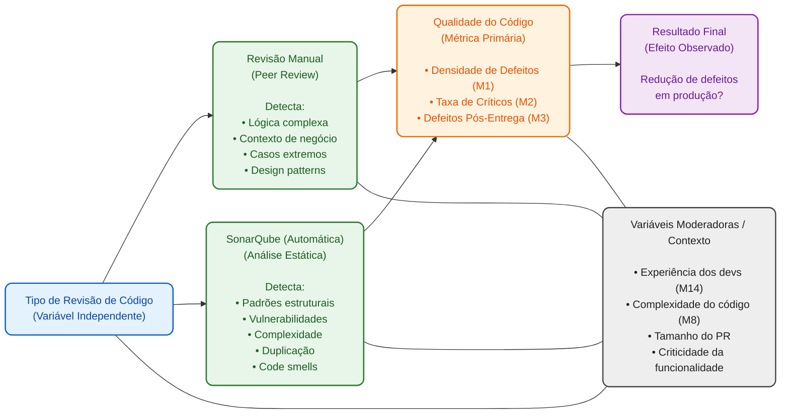
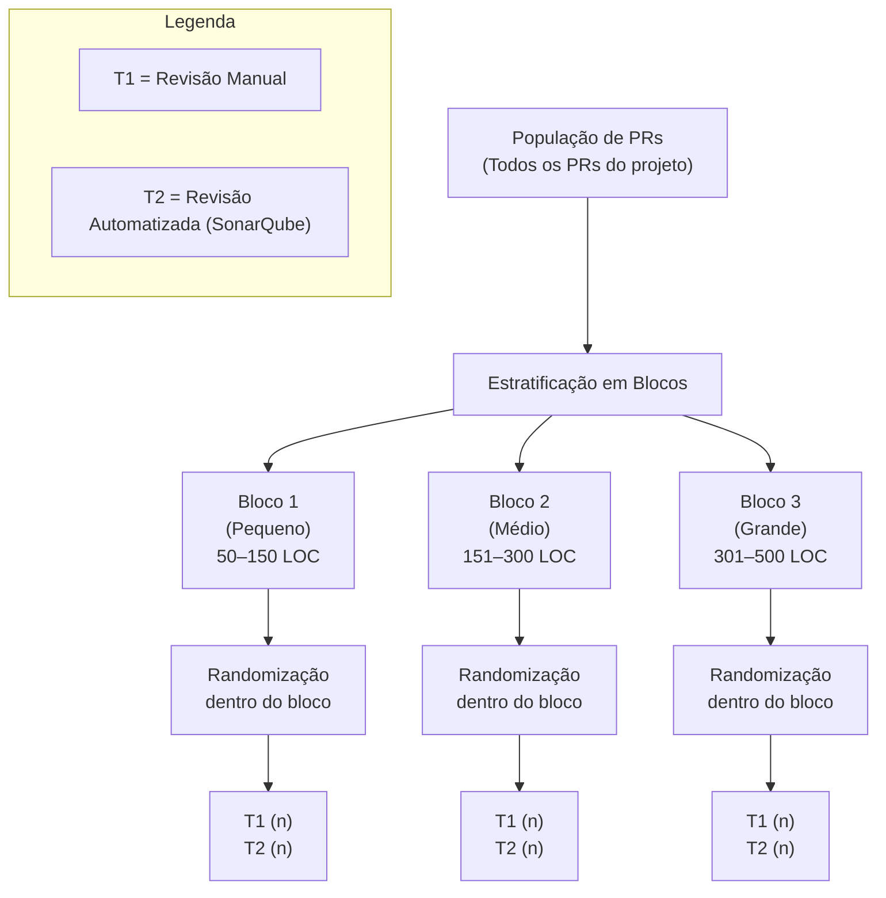
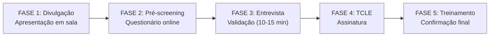
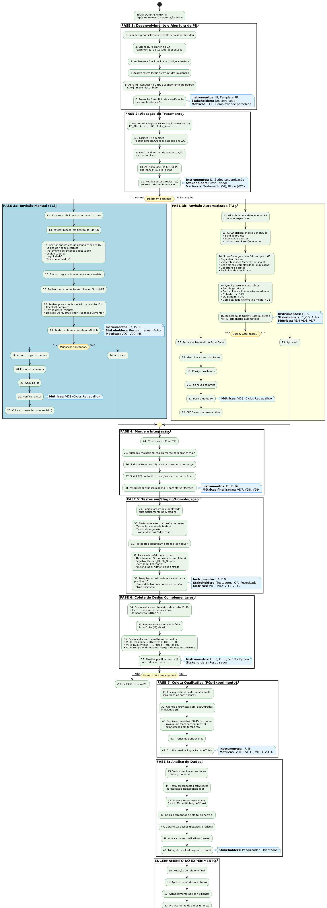
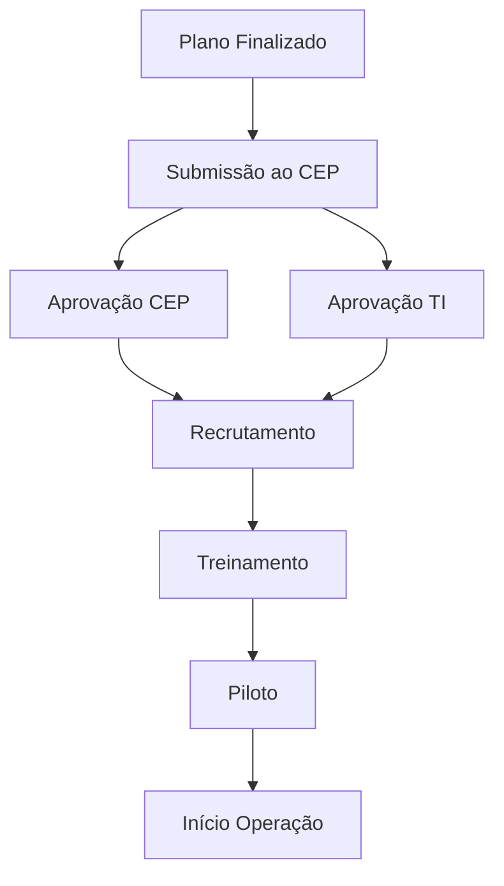

# Plano de Experimento – Scoping e Planejamento

## 1. Identificação básica

### 1.1 Título do experimento
Comparação entre revisão de código manual (peer review) e revisão automatizada por SonarQube na redução da densidade de defeitos em projetos Java.

### 1.2 ID / código
EXP-SE-001

### 1.3 Versão do documento e histórico de revisão
- **Versão atual:** v4.0  
- **Histórico:**  
  - v1.0 — criação inicial do documento, contendo escopo e fundamentos teóricos.
  - v2.0 — expansão com objetivos específicos, GQM, stakeholders e riscos.
  - v3.0 — modelo conceitual e hipóteses; variáveis, fatores, tratamentos e objetos de estudo; desenho experimental
  - v3.1 — ajustes de precisão nas métricas e operacionalização de critérios.
  - v4.0 — População, sujeitos e amostragem; Instrumentação e protocolo operacional; Plano de análise de dados (pré-execução) + Avaliação de validade (ameaças e mitigação)
  - v5.0 — Ética, privacidade e conformidade Recursos, infraestrutura e orçamento Cronograma, marcos e riscos operacionais
  - v5.1 — Atualização dos diagramas para formato Mermaid.js
  - v5.2 — Remoção de redundâncias em determinadas seções, correção no tópico 8.7 e condensação do tópico 13
  - v6.0 — Revisão geral do documento, padronização de formatação e verificação de consistência entre seções.

### 1.4 Datas (criação, última atualização)
- **Data de criação:** 23/11/2025  
- **Última atualização:** 02/12/2025

### 1.5 Autores (nome, área, contato)
- **Autor:** [Gabriel Ferreira Amaral] — Engenharia de Software — gabriel.afa@outlook.com

### 1.6 Responsável principal (PI / dono do experimento)
[Gabriel Ferreira Amaral] — responsável pelo direcionamento científico do estudo.

### 1.7 Projeto / produto / iniciativa relacionada
Projeto acadêmico de desenvolvimento de software em Java, vinculado à disciplina de Engenharia de Software e ao Experimento de Trabalho de Conclusão de Curso (TCC).  
Foco: análise comparativa de práticas de garantia de qualidade no ciclo de desenvolvimento.

---

## 2. Contexto e problema

### 2.1 Descrição do problema / oportunidade
Equipes de desenvolvimento utilizam revisões de código manuais como mecanismo principal de detecção de defeitos antes da integração. Contudo, ferramentas de análise estática, como SonarQube, têm sido adotadas para automatizar parte desse processo, oferecendo relatórios imediatos sobre problemas estruturais, duplicações e vulnerabilidades.  
Ainda não há clareza, no contexto estudado, sobre qual método resulta em menor densidade de defeitos pós-entrega. Assim, surge a oportunidade de comparar empiricamente esses dois métodos de revisão com base em métricas objetivas de qualidade.

### 2.2 Contexto organizacional e técnico
O experimento será conduzido em um ambiente acadêmico, com equipes de estudantes desenvolvendo sistemas Java utilizando GitHub, CI/CD básico e práticas ágeis.  
Tecnologias relevantes incluem:
- Java 17+, Spring Boot  
- Git e GitHub (branches, PRs, issues)  
- SonarQube (regras padrão + qualidade mínima exigida)  
- GitHub Actions para integração contínua  

O processo padrão envolve desenvolvimento em feature branches, abertura de pull requests, revisão manual e posterior integração.

### 2.3 Trabalhos e evidências prévias (internos e externos)
Evidências existentes incluem:
- Estudos empíricos que avaliam a eficácia da revisão de código manual na redução de defeitos.  
- Pesquisas sobre o uso de ferramentas como SonarQube para identificação automática de smells e vulnerabilidades.  
- Estudos comparativos mostrando que cada abordagem captura tipos diferentes de problemas (manuais captam lógica; ferramentas captam padrões estruturais).  
- Em contextos internos, observou-se aumento de retrabalho quando revisões manuais são superficiais e ausência de ferramentas automatizadas leva à negligência de problemas estruturais.

### 2.4 Referencial teórico e empírico essencial
O experimento fundamenta-se nos seguintes conceitos-chave:
- **Code Review Manual:** técnica tradicional que envolve inspeção humana do código, amplamente adotada em processos ágeis e DevOps.  
- **Análise Estática de Código:** uso de ferramentas que identificam problemas automaticamente antes da execução, como complexidade, duplicação, vulnerabilidades e violações de boas práticas.  
- **Qualidade de Software:** conceitos como densidade de defeitos, complexidade ciclomática, cobertura de testes e maintainability index orientam o estudo.  
- **Engenharia de Software Empírica:** uso de experimentos controlados para avaliar práticas de desenvolvimento e fundamentar decisões baseadas em evidências.  
- **Estudos anteriores** mostram que combinar revisão manual com análises automatizadas pode melhorar a qualidade, mas o impacto relativo e isolado de cada abordagem ainda é pouco quantificado em ambientes pequenos/médios.

## 3. Objetivos e Questões (Goal / Question / Metric)

### 3.1 Objetivo Geral (Goal Template)

**Analisar** a efetividade de duas estratégias de revisão de código (manual e automatizada via SonarQube) **com o propósito de** identificar qual método resulta em menor densidade de defeitos pós-entrega e maior qualidade estrutural, **sob a perspectiva de** gerentes de qualidade, desenvolvedores e arquitetos de software, **no contexto de** projetos acadêmicos de desenvolvimento Java em equipes pequenas/médias (4-6 pessoas).

---

### 3.2 Objetivos Específicos

| ID | Objetivo Específico | Descrição |
|---|---|---|
| O1 | Comparar a densidade de defeitos | Medir e comparar a quantidade de defeitos detectados pós-entrega em sprints com revisão manual versus automatizada |
| O2 | Avaliar a cobertura de detecção | Identificar quais categorias de problemas (segurança, complexidade, duplicação, etc.) cada método detecta melhor |
| O3 | Quantificar o impacto no tempo e esforço | Medir tempo gasto em revisão, número de comentários gerados e ciclos de retrabalho em cada abordagem |
| O4 | Analisar a satisfação e percepção | Avaliar a aceitação, confiança e conforto dos desenvolvedores com cada método de revisão |

---

### 3.3 Tabela GQM (Goal / Question / Metric)

| Objetivo | Pergunta (Q) | Métricas Associadas | ID Métricas |
|---|---|---|---|
| O1 | Q1.1: Qual é a densidade de defeitos detectados após entrega entre os dois métodos? | M1 (Densidade de Defeitos), M2 (Taxa de Defeitos Críticos) | M1, M2 |
| O1 | Q1.2: Quantos defeitos são encontrados em produção/homologação para cada abordagem? | M3 (Defeitos Pós-Entrega), M4 (Severity Distribution) | M3, M4 |
| O1 | Q1.3: Qual é a correlação entre problemas identificados em revisão e defeitos reais em produção? | M1 (Densidade de Defeitos), M5 (True Positive Rate) | M1, M5 |
| O2 | Q2.1: Quantos problemas de segurança cada método consegue identificar? | M6 (Vulnerabilidades Detectadas), M7 (Security Issues) | M6, M7 |
| O2 | Q2.2: Qual é o desempenho de cada método na identificação de complexidade excessiva? | M8 (Complexidade Ciclomática Média), M2 (Taxa de Defeitos Críticos) | M8, M2 |
| O2 | Q2.3: Como cada abordagem se comporta na detecção de duplicação de código? | M9 (Duplicação de Código %), M5 (True Positive Rate) | M9, M5 |
| O3 | Q3.1: Quanto tempo é gasto em cada tipo de revisão? | M10 (Tempo Médio de Revisão), M11 (Ciclos de Retrabalho) | M10, M11 |
| O3 | Q3.2: Qual é o volume de comentários/feedback gerado em cada método? | M12 (Número de Comentários), M10 (Tempo Médio de Revisão) | M12, M10 |
| O3 | Q3.3: Quantos ciclos de retrabalho são necessários em cada abordagem? | M11 (Ciclos de Retrabalho), M3 (Defeitos Pós-Entrega) | M11, M3 |
| O4 | Q4.1: Como os desenvolvedores avaliam a utilidade de cada método? | M13 (Satisfação Percebida), M14 (Confiança no Método) | M13, M14 |
| O4 | Q4.2: Qual método é considerado menos intrusivo/mais aceitável? | M14 (Confiança no Método), M15 (Taxa de Adoção) | M14, M15 |
| O4 | Q4.3: Qual é o aprendizado percebido pelos desenvolvedores em cada estratégia? | M13 (Satisfação Percebida), M16 (Feedback Qualitativo) | M13, M16 |

---

### 3.4 Catálogo de Métricas

| ID | Nome da Métrica | Descrição | Unidade | Fonte de Dados |
|---|---|---|---|---|
| M1 | Densidade de Defeitos | Número de defeitos encontrados pós-entrega por 1.000 linhas de código | defeitos/KLOC | Relatórios de defeitos, análise de issues |
| M2 | Taxa de Defeitos Críticos | Percentual de defeitos com severidade crítica ou alta em relação ao total | % | Sistema de gerenciamento de defeitos |
| M3 | Defeitos Pós-Entrega | Número absoluto de defeitos identificados após entrega/merge para main | quantidade | GitHub Issues, sistema de rastreamento de bugs |
| M4 | Severity Distribution | Distribuição de defeitos por nível de severidade (crítico, alto, médio, baixo) | % por severidade | Análise de defeitos registrados |
| M5 | True Positive Rate | Percentual de problemas flagged que correspondem a defeitos reais | % | Validação manual/testes de aceitação |
| M6 | Vulnerabilidades Detectadas | Número total de vulnerabilidades de segurança identificadas | quantidade | Relatórios SonarQube + comentários de revisão manual |
| M7 | Security Issues | Número específico de issues ligados a segurança (SQL injection, XSS, etc.) | quantidade | SonarQube + análise manual |
| M8 | Complexidade Ciclomática Média | Média da complexidade de funções/métodos no código revisado | índice | SonarQube metrics |
| M9 | Duplicação de Código % | Percentual de linhas duplicadas em relação ao total do projeto | % | SonarQube duplicate detection |
| M10 | Tempo Médio de Revisão | Tempo gasto por um revisor/ferramenta para revisar um PR | minutos | Timestamps de PR, logs de análise SonarQube |
| M11 | Ciclos de Retrabalho | Número de vezes que um PR requer correções antes da aprovação | quantidade | Histórico de commits/iterações em PR |
| M12 | Número de Comentários | Quantidade total de comentários (feedback) deixados em revisão | quantidade | GitHub PR comments |
| M13 | Satisfação Percebida | Avaliação subjetiva dos desenvolvedores quanto à utilidade do método (escala 1-5) | escala Likert | Pesquisa/questionário pós-experimento |
| M14 | Confiança no Método | Grau de confiança que os desenvolvedores têm na capacidade do método identificar problemas | escala Likert (1-5) | Entrevista/questionário estruturado |
| M15 | Taxa de Adoção | Percentual de PRs que seguem o protocolo de revisão proposto | % | Auditoria de PRs no repositório |
| M16 | Feedback Qualitativo | Observações e comentários coletados via entrevistas semi-estruturadas | texto/temas | Transcrições de entrevistas |

---

## 4. Escopo e Contexto do Experimento

### 4.1 Escopo Funcional / de Processo

#### Incluído no escopo:
- Desenvolvimento de features/user stories em Java utilizando Spring Boot
- Abertura de pull requests (PRs) no GitHub
- Aplicação da estratégia de revisão manual (peer review tradicional) em metade dos PRs
- Aplicação da estratégia de revisão automatizada (SonarQube) em outra metade dos PRs
- Registro de métricas de qualidade pré e pós-integração
- Testes em ambiente de staging/homologação para detecção de defeitos reais
- Coleta de feedback qualitativo via entrevistas/questionários com desenvolvedores
- Análise comparativa dos resultados entre os dois métodos

#### Excluído do escopo:
- Revisão de infraestrutura e DevOps
- Análise de performance (tempo de execução, throughput)
- Testes de aceitação por usuários finais
- Modificações estruturais no SonarQube ou criação de regras customizadas (utilizar configuração padrão)
- Análise de impacto em projetos de larga escala (>100 KLOC)
- Outras ferramentas de análise estática (Findbugs, SpotBugs, Checkstyle) — foco exclusivo em SonarQube
- Revisão de código de testes unitários (escopo limitado a lógica de negócio)

---

### 4.2 Contexto do Estudo

| Aspecto | Descrição |
|---|---|
| **Tipo de Organização** | Acadêmica (instituição de ensino superior) |
| **Tamanho** | Pequeno (4-6 estudantes por equipe) |
| **Tipo de Projeto** | Desenvolvimento de aplicação web (back-end Java + frontend básico) |
| **Criticidade** | Média (projeto acadêmico, sem críticos em produção real) |
| **Perfil de Experiência dos Participantes** | Misto: estudantes do 4º/5º semestre com experiência variada em Java (6-18 meses) |
| **Ambiente de Execução** | Repositório GitHub; CI/CD com GitHub Actions; SonarQube em cloud gratuito ou self-hosted; staging em servidor de testes |
| **Duração Prevista** | 3-4 sprints (6-8 semanas) |
| **Linguagem de Programação** | Java 17+ |
| **Framework Principal** | Spring Boot 3.x |

---

### 4.3 Premissas

| ID | Premissa | Justificativa |
|---|---|---|
| P1 | Todos os participantes possuem experiência básica em Git, GitHub e Java | Necessário para aplicação consistente de ambos os métodos |
| P2 | SonarQube permanecerá disponível e estável durante todo o experimento | Falhas de ferramenta invalidariam dados da abordagem automatizada |
| P3 | Os PRs são do tamanho e complexidade comparáveis entre os dois grupos | Necessário para comparação justa entre métodos |
| P4 | Os revisores manuais aplicarão critérios consistentes e fundamentados | Reduz viés e padroniza a qualidade da revisão manual |
| P5 | Os testes em homologação identificarão adequadamente defeitos reais | Essencial para validar se os métodos capturam problemas significativos |
| P6 | A equipe manterá registro consistente de tempo, comentários e iterações | Dados essenciais para M10, M11, M12 |

---

### 4.4 Restrições

| Tipo | Descrição | Impacto |
|---|---|---|
| **Tempo** | Disponibilidade de sprints acadêmicos limitada a 6-8 semanas | Pode reduzir volume de PRs analisados; limita profundidade de análise |
| **Orçamento** | Projeto sem financiamento; uso de ferramentas gratuitas | SonarQube limitado a cloud gratuito ou versão community; sem suporte premium |
| **Ferramentas** | GitHub Actions com quotas gratuitas; SonarQube comunidade | Sem acesso a features premium; possíveis limitações de relatórios |
| **Acesso** | Ambiente de staging compartilhado; possível contenção de recursos | Testes em homologação podem sofrer atrasos; variabilidade nos resultados |
| **Amostra** | Pequena equipe (4-6 pessoas) | Baixa generalização; possível viés por conhecimento interpessoal |
| **Regras Organizacionais** | Calendário acadêmico rígido; feriados e períodos de prova | Interrupções involuntárias no fluxo de desenvolvimento |

---

### 4.5 Limitações Previstas (Validez Externa)

- **Contexto acadêmico vs. industrial:** resultados podem não ser generalizáveis para equipes profissionais com projetos críticos
- **Tamanho reduzido da amostra:** 4-6 desenvolvedores; conclusões limitadas em relação a equipes maiores (10+)
- **Projeto pequeno/médio:** aplicação a sistemas com >200 KLOC pode apresentar dinâmica diferente
- **Configuração padrão do SonarQube:** não reflete customizações específicas de organizações reais
- **Possível Hawthorne effect:** desenvolvedores sabem que estão sendo avaliados; comportamento pode não refletir prática rotineira
- **Falta de randomização verdadeira:** possível viés na atribuição de PRs aos grupos (manual vs. automatizado)
- **Curva de aprendizado:** equipe pode melhorar ao longo do tempo, confundindo efeito do método com maturação

---

## 5. Stakeholders e Impacto Esperado

### 5.1 Stakeholders Principais

| Stakeholder | Descrição | Interesse |
|---|---|---|
| **Desenvolvedores (Participantes)** | Estudantes que desenvolvem e revisam código no experimento | Compreender qual método agrega mais valor; reduzir retrabalho |
| **Professor/Orientador** | Responsável acadêmico pelo experimento; orienta pesquisa | Validar hipóteses; gerar conhecimento científico sobre práticas de qualidade |
| **Gerentes de Qualidade / QA** | Profissionais interessados em políticas de revisão | Embasar decisão sobre adoção de ferramentas automatizadas |
| **Arquitetos de Software** | Responsáveis por definir padrões de qualidade e processos | Fundamentar padrões de revisão; definir políticas de integração |
| **Comunidade Acadêmica** | Outros estudantes, pesquisadores em Engenharia de Software | Contribuir com evidências para tomadas de decisão em contextos similares |

---

### 5.2 Interesses e Expectativas dos Stakeholders

| Stakeholder | Expectativa | Benefício Esperado |
|---|---|---|
| **Desenvolvedores** | Aprender quais técnicas de revisão são mais eficazes | Melhorar qualidade do código; reduzir tempo em revisão improdutiva |
| **Professor/Orientador** | Gerar dados empíricos sólidos para publicação ou conclusão de TCC | Fundamentar recomendações com evidência; contribuir ao conhecimento em ES |
| **Gerentes de Qualidade** | Conhecer o custo-benefício de ferramentas automatizadas vs. manual | Justificar investimento em ferramentas; otimizar processo de QA |
| **Arquitetos** | Definir políticas de revisão baseadas em evidências | Padronizar prática; aumentar eficiência e qualidade de produtos |
| **Comunidade Acadêmica** | Ter estudo de referência em revisão de código | Usar como base para pesquisas futuras; informar curriculum |

---

### 5.3 Impactos Potenciais no Processo / Produto

#### Durante o experimento:
- Possível aumento inicial de tempo em code review devido ao protocolo estruturado
- Carga adicional na equipe por coleta de dados e pesquisas
- Possível desconforto com mudanças de processo habitual
- Contenção de recursos em ambiente de staging durante testes

#### Após o experimento:
- Recomendações fundamentadas sobre estratégia de revisão a adotar
- Melhor compreensão dos pontos fortes de cada abordagem
- Potencial adoção de método híbrido (manual + automatizado)
- Aumento de confiança na qualidade do código entregue
- Base para políticas de qualidade em futuras disciplinas/projetos

---

## 6. Riscos de Alto Nível, Premissas e Critérios de Sucesso

### 6.1 Riscos de Alto Nível (Negócio, Técnicos, etc.)

| ID | Risco | Categoria | Probabilidade | Impacto | Mitigation | Contingência |
|---|---|---|---|---|---|---|
| R1 | Indisponibilidade ou falha do SonarQube durante experimento | Técnico | Média | Alto | Usar cloud gratuito com SLA; ter backup local self-hosted | Pausar coleta de dados; ampliar janela de tempo |
| R2 | Baixa adesão da equipe ao protocolo estruturado | Negócio/Pessoas | Alta | Alto | Comunicar claramente benefícios; treinar participantes | Reforçar incentivos; ajustar protocolo se necessário |
| R3 | Falta de defeitos suficientes em produção para validar diferenças | Técnico | Média | Alto | Usar testes rigorosos em staging; considerar defeitos simulados | Ampliar critério de "defeito"; aumentir período experimental |
| R4 | Viés do Hawthorne (comportamento alterado por observação) | Pesquisa | Alta | Médio | Minimizar comunicação sobre métricas durante experimento | Coletar dados retrospectivamente; validar com histórico |
| R5 | Atrito de participantes (desistências, indisponibilidade) | Negócio | Média | Médio | Recrutar com antecedência; ter suplentes preparados | Reduzir escopo; alongar cronograma |
| R6 | Inconsistência na aplicação de critérios de revisão manual | Pesquisa | Alta | Médio | Desenvolver checklist; treinamento de revisores; auditar amostra | Padronizar critérios retrospectivamente; usar média de 2+ revisores |
| R7 | Problemas técnicos em CI/CD ou repositório | Técnico | Média | Médio | Usar infraestrutura confiável (GitHub); backup de dados | Restaurar de backup; repetir análise |
| R8 | Amostra insuficiente de PRs por falta de atividade de desenvolvimento | Negócio | Média | Alto | Estimular fluxo de features; usar sprints curtas | Estender calendário; aceitar N menor com análise mais cautelosa |

---

### 6.2 Critérios de Sucesso Globais (Go / No-Go)

| Critério | Condição | Decisão | Responsável |
|---|---|---|---|
| **C1** | Mínimo 20 PRs por grupo (40 no total) coletados com dados completos | **Go:** ≥40 PRs; **No-Go:** <30 PRs | Pesquisador |
| **C2** | Pelo menos 10+ defeitos pós-entrega identificados (distribuídos entre grupos) para permitir análise estatística significativa | **Go:** ≥10 defeitos totais; **No-Go:** <5 defeitos | QA / Testes |
| **C3** | Taxa de aderência ao protocolo ≥80% (pelo menos 80% dos PRs seguem o método designado) | **Go:** ≥80%; **No-Go:** <60% | Pesquisador |
| **C4** | Dados de todas as 16 métricas coletados com <10% de valores faltantes | **Go:** <10% faltantes; **No-Go:** >20% faltantes | Pesquisador |
| **C5** | Teste t / Mann-Whitney pode ser executado com validade estatística (pressupostos testados) | **Go:** Pressupostos atendidos; **No-Go:** Violações graves | Analista |
| **C6** | Pelos menos 80% dos participantes completam questionário/entrevista qualitativa | **Go:** ≥80%; **No-Go:** <50% | Pesquisador |

**Decisão Final:** Experimento considerado bem-sucedido se **mínimo 5 de 6 critérios** forem atingidos (Go).

---

### 6.3 Critérios de Parada Antecipada (Pré-Execução)

| Situação | Ação | Responsável |
|---|---|---|
| **Reprovação ética** — Comitê de ética não aprova protocolo experimental | **Cancelar** experimento até aprovação ser obtida | Professor / Coordenador |
| **Recursos críticos indisponíveis** — SonarQube ou GitHub indisponíveis por >5 dias consecutivos antes de início | **Adiar** para data posterior; buscar alternativas | Pesquisador + TI |
| **Baixa adesão inicial** — <50% da equipe confirmada na fase de recrutamento | **Revisar escopo** e redimensionar; ou **cancelar** se não viável | Professor / Pesquisador |
| **Mudança significativa de contexto** — Calendário acadêmico alterado; feriados não previstos prolongam gap >6 meses | **Renegociar** cronograma; se impacto muito grande, **cancelar** | Coordenador Acadêmico |
| **Impossibilidade técnica demonstrada** — Stack Java não compatível com SonarQube; ambiente não suporta CI/CD | **Adiar** até resolver; considerar **mudança de tecnologia** | Pesquisador + TI |
| **Conflito de interesses ou viés não mitigável** — Revisor manual é também author do código; resultados confundidos | **Redesenhar amostra** ou **parar experimento** | Professor |

---

## 7. Modelo Conceitual e Hipóteses

### 7.1 Modelo Conceitual do Experimento

#### Diagrama de Influências

#### Mecanismo de Ação Esperado

**Hipótese Conceitual:**

1. **Revisão Manual** funciona melhor para detectar problemas de lógica, contexto de negócio e casos extremos, pois um revisor experiente compreende a intenção e pode identificar fluxos anômalos.

2. **Análise Estática (SonarQube)** funciona melhor para identificar padrões estruturais repetitivos, vulnerabilidades conhecidas, complexidade excessiva e duplicação, pois executa regras consistentes em todo o código.

3. **Esperado (H₁ direcional):** Combinando ambos os métodos, é possível capturar categorias diferentes de problemas, resultando em menor densidade de defeitos pós-entrega que qualquer método isolado.

4. **Incerteza Principal:** Qual método (manual ou automatizado) reduz *mais* defeitos críticos que chegam à produção? Ou não há diferença significativa?

---

### 7.2 Hipóteses Formais (H₀, H₁)

#### Hipótese Principal (Bilateral)

**H₀ (Hipótese Nula):**

Não há diferença estatisticamente significativa na densidade de defeitos pós-entrega entre código revisado manualmente e código revisado automaticamente via SonarQube em projetos Java pequenos/médios.

Formalmente: *μ(Defeitos_Manual) = μ(Defeitos_SonarQube)*

**H₁ (Hipótese Alternativa - Bilateral):**

Existe diferença estatisticamente significativa na densidade de defeitos pós-entrega entre os dois métodos de revisão.

Formalmente: *μ(Defeitos_Manual) ≠ μ(Defeitos_SonarQube)*

---

#### Hipóteses Secundárias (Exploratórias)

| ID | Questão | H₀ | H₁ (Direção Esperada) |
|---|---|---|---|
| H2 | Qual método detecta mais vulnerabilidades de segurança? | Nenhuma diferença em M6/M7 | SonarQube > Manual (automatizado detecta padrões) |
| H3 | Qual método identifica melhor problemas de complexidade? | Nenhuma diferença em M8 | SonarQube > Manual (métrica objetiva) |
| H4 | Qual abordagem gasta menos tempo em revisão? | Tempo Manual = Tempo SonarQube (M10) | SonarQube < Manual (automatizado é mais rápido) |
| H5 | Desenvolvedores confiam mais em qual método? | Confiança Manual = Confiança SonarQube (M14) | Manual ≥ SonarQube (experiência humana) |
| H6 | Qual método resulta em menos ciclos de retrabalho? | Ciclos Manual = Ciclos SonarQube (M11) | SonarQube < Manual (menos ambiguidade) |

---

### 7.3 Nível de Significância e Considerações de Poder

#### Nível de Significância (α)

**α = 0.05** (confiança de 95%)

**Justificativa:** Nível padrão em pesquisa de Engenharia de Software; oferece balanço aceitável entre risco de erro Tipo I (rejeitar H₀ quando verdadeira) e Tipo II (não rejeitar H₀ quando falsa).

---

#### Considerações de Poder Estatístico

| Parâmetro | Valor | Justificativa |
|---|---|---|
| **Poder (1 - β)** | 0.80 (80%) | Padrão em pesquisa aplicada; β = 0.20 (risco aceitável de Erro Tipo II) |
| **Tamanho de Efeito (d de Cohen)** | ≥ 0.5 | Efeito médio; diferenças práticas entre métodos devem ser detectáveis |
| **Tamanho de Amostra Planejado (n)** | ~20-30 PRs por grupo (40-60 total) | Baseado em cálculo a posteriori para poder 0.80, α=0.05, d=0.5 |
| **Teste Estatístico** | Teste t de Student (two-tailed) ou Mann-Whitney U (não-paramétrico) | t apropriado para N > 15; Mann-Whitney se pressupostos de normalidade violados |

---

#### Análise de Poder Prognóstica

**Cálculo Estimado (usando G*Power ou fórmula de Cohen):**

Para teste t independente com:
- α = 0.05 (two-tailed)
- Poder = 0.80
- d = 0.5 (efeito médio)

**N necessário ≈ 64 por grupo** (128 total para máxima precisão)

**Realidade do projeto:**
- N planejado = 20-30 PRs por grupo (~40-60 total)
- Poder esperado ≈ 0.60-0.70 (reduzido, mas aceitável em pesquisa aplicada)
- **Implicação:** Estudo tem poder moderado; diferenças pequenas (d < 0.3) podem não ser detectadas; intervalos de confiança serão mais largos

**Mitigação:**
- Priorizar detecção de efeitos de tamanho médio ou maior (d ≥ 0.5)
- Relatar intervalos de confiança (IC 95%) além de p-values
- Usar análise de tamanho de efeito (Cohen's d, η²) para complementar testes clássicos
- Justificar conclusões conservadoras quando poder é limitado

---

#### Pressupostos Estatísticos a Testar

Antes de aplicar teste t, serão validados:

1. **Normalidade:** Teste de Shapiro-Wilk ou gráfico Q-Q para cada grupo
2. **Homogeneidade de Variâncias:** Teste de Levene
3. **Independência:** Garantida pelo design (amostras aleatórias, grupos distintos)

Se pressupostos forem violados:
- Usar **teste Mann-Whitney U** (não-paramétrico, mais robusto)
- Aplicar **transformações logarítmicas** aos dados se apropriado
- Reportar tanto teste paramétrico quanto não-paramétrico

## 8. Variáveis, fatores, tratamentos e objetos de estudo

### 8.1 Objetos de estudo

**Pull Requests (PRs)** contendo implementações de features ou correções de bugs em código Java/Spring Boot, com 50-500 linhas de código modificadas.

### 8.2 Sujeitos / participantes (visão geral)

4-6 estudantes de graduação em Ciência da Computação/Engenharia de Software, com mínimo 6 meses de experiência em Java e conhecimento básico de Git/GitHub.

### 8.3 Variáveis independentes (fatores) e seus níveis

| Fator | Níveis (Tratamentos) | Tipo |
|---|---|---|
| **F1: Método de Revisão** | **Nível 1:** Revisão Manual (Peer Review)   **Nível 2:** Revisão Automatizada (SonarQube) | Categórico (2 níveis) |

### 8.4 Tratamentos (condições experimentais)

| Tratamento | Descrição |
|---|---|
| **T1: Controle (Revisão Manual)** | PR passa por revisão humana tradicional usando checklist padronizado, sem ferramentas automatizadas |
| **T2: Tratamento (Revisão Automatizada SonarQube)** | PR passa por análise estática automática; aprovação baseada em quality gate da ferramenta |

### 8.5 Variáveis dependentes (respostas)

| ID | Nome da Variável | Descrição | Unidade |
|---|---|---|---|
| **VD1** | Densidade de Defeitos Pós-Entrega | Defeitos em staging após merge, por 1.000 LOC | defeitos/KLOC |
| **VD2** | Taxa de Defeitos Críticos | % de defeitos com severidade crítica/alta | % |
| **VD3** | Defeitos Pós-Entrega (Absoluto) | Número absoluto de defeitos após merge | quantidade |
| **VD4** | Vulnerabilidades Detectadas | Total de vulnerabilidades identificadas na revisão | quantidade |
| **VD5** | Complexidade Ciclomática Média | Média da complexidade dos métodos no PR | índice |
| **VD6** | Duplicação de Código | % de linhas duplicadas no PR | % |
| **VD7** | Tempo de Revisão | Tempo desde abertura até aprovação do PR | minutos |
| **VD8** | Ciclos de Retrabalho | Iterações necessárias antes da aprovação | quantidade |
| **VD9** | Número de Comentários | Comentários de revisão ou issues flagadas | quantidade |
| **VD10** | Satisfação Percebida | Avaliação subjetiva sobre utilidade do método | Likert (1-5) |
| **VD11** | Confiança no Método | Grau de confiança na capacidade de identificar problemas | Likert (1-5) |

**Variáveis Primárias:** VD1, VD2, VD7

### 8.6 Variáveis de controle / bloqueio

| ID | Variável | Estratégia de Controle |
|---|---|---|
| **VC1** | Tamanho do PR (LOC) | Bloqueio em 3 grupos: pequeno (50-150), médio (151-300), grande (301-500) |
| **VC2** | Complexidade da Feature | Bloqueio: simples/média/complexa |
| **VC3** | Experiência do Desenvolvedor | Rodízio de autores entre tratamentos |
| **VC4** | Configuração do SonarQube | Configuração padrão mantida constante |
| **VC5** | Checklist de Revisão Manual | Checklist padronizado para todos revisores |

### 8.7 Possíveis variáveis de confusão conhecidas

| ID | Variável de Confusão | Estratégia de Mitigação |
|---|---|---|
| **CF1** | Efeito Hawthorne | Coleta discreta; não revelar grupo do PR |
| **CF2** | Aprendizado / Maturação | Controlar por sprint; alternar tratamentos |
| **CF3** | Viés de Seleção de Tarefas | Randomização e bloqueio por complexidade |
| **CF4** | Diferenças entre Revisores | Treinamento padronizado; checklist obrigatório |

---

## 9. Desenho experimental

### 9.1 Tipo de desenho

**Desenho em Blocos Randomizados (Randomized Block Design)**

### 9.2 Randomização e alocação

1. PR é classificado por tamanho (LOC) e alocado ao bloco correspondente
2. Dentro de cada bloco, randomização para T1 ou T2 usando gerador aleatório
3. Restrição de balanceamento: diferença máxima de 2 PRs entre T1 e T2 por bloco

### 9.3 Balanceamento e contrabalanço

- **Balanceamento de tamanho:** N_T1 ≈ N_T2 dentro de cada bloco
- **Balanceamento de autores:** Cada desenvolvedor contribui com PRs em ambos os tratamentos
- **Contrabalanço:** Metade dos desenvolvedores inicia com T1, outra metade com T2

### 9.4 Número de grupos e sessões

- **2 grupos de tratamento:** T1 (Manual) e T2 (SonarQube)
- **3 blocos** por tamanho de PR
- **Total:** 6 células experimentais (2 tratamentos × 3 blocos)

---

## 10. População, sujeitos e amostragem

### 10.1 População-alvo

Desenvolvedores que trabalham com Java e Spring Boot em equipes pequenas (4-6 pessoas), em contextos acadêmicos ou industriais.

### 10.2 Critérios de inclusão de sujeitos

| Critério | Descrição |
|---|---|
| Matriculado na disciplina | Aluno regular em Engenharia de Software |
| Experiência com Java | Mínimo 6 meses |
| Experiência com Git/GitHub | Criar branches, PRs e code review básico |
| Disponibilidade | 3-4 horas/semana |
| Consentimento | TCLE assinado |

### 10.3 Critérios de exclusão de sujeitos

- Experiência insuficiente (<6 meses Java)
- Indisponibilidade comprovada (<3h/semana)
- Conflito de interesse
- Desistência durante experimento
- Falta de adesão ao protocolo

### 10.4 Tamanho da amostra planejado

- **Total:** 40-60 PRs
- **Por grupo:** 20-30 PRs
- **Parâmetros:** α=0.05, poder=0.80, d=0.5 (efeito médio)

### 10.5 Método de seleção / recrutamento

### 10.6 Treinamento e preparação dos sujeitos

| Módulo | Duração | Conteúdo |
|---|---|---|
| Visão Geral | 30 min | Objetivos, estrutura, cronograma |
| Revisão Manual | 45 min | Checklist, exemplos, prática |
| SonarQube | 45 min | Tour, interpretação, quality gate |
| GitHub/CI/CD | 30 min | Workflow, alocação, registro |
| Ética | 20 min | Direitos, confidencialidade |

---

## 11. Instrumentação e protocolo operacional

### 11.1 Instrumentos de coleta

| ID | Instrumento | Formato | Variáveis Coletadas |
|---|---|---|---|
| **I1** | Planilha de Registro de PRs | Google Sheets | PR_ID, Autor, LOC, Bloco, Tratamento |
| **I2** | Checklist de Revisão Manual | Google Forms | Critérios de qualidade, tempo |
| **I3** | Relatórios SonarQube | JSON (API) | Bugs, vulnerabilities, complexity |
| **I4** | Registro de Defeitos | GitHub Issues | Severidade, categoria, PR origem |
| **I5** | Logs de Tempo | CSV (GitHub API) | Timestamps de eventos |
| **I7** | Questionário Pós-Experimento | Google Forms | Satisfação, confiança |
| **I8** | Entrevista Semi-Estruturada | Áudio + Transcrição | Feedback qualitativo |

### 11.2 Materiais de suporte

- Guia do Participante (PDF, 10 páginas)
- Checklist de Revisão Manual (PDF, 2 páginas)
- Guia Rápido do SonarQube (PDF + vídeo)
- Templates de PR e Issue de Defeito (Markdown)
- Fluxograma do Protocolo (PDF A3)

### 11.3 Procedimento experimental (protocolo)

### 11.4 Plano de piloto

| Aspecto | Detalhamento |
|---|---|
| Participantes | 2-3 desenvolvedores voluntários |
| Duração | 1 sprint (2 semanas) |
| Número de PRs | 4-6 PRs (2-3 por tratamento) |
| Objetivo | Validar protocolo, instrumentos e infraestrutura |

**Critérios Go/No-Go pós-piloto:**
- Viabilidade técnica: tudo funciona
- Clareza do protocolo: ≥80% aderência
- Qualidade dos dados: <20% faltantes

---

## 12. Plano de análise de dados

### 12.1 Estratégia geral de análise

| Questão | Variáveis | Técnica |
|---|---|---|
| Comparar densidade de defeitos | VD1, VC1 | t-test / Mann-Whitney / ANOVA |
| Comparar defeitos pós-entrega | VD3 | Wilcoxon / χ² |
| Tempo de revisão | VD7 | t-test / ANCOVA |
| Satisfação/Confiança | VD10, VD11 | Mann-Whitney + qualitativo |

### 12.2 Métodos estatísticos planejados

**Testes paramétricos:** t-test, ANOVA, ANCOVA, Correlação Pearson

**Testes não-paramétricos:** Mann-Whitney, Kruskal-Wallis, Spearman, χ²

**Tamanho de efeito:** Cohen d, r, η², V de Cramér

### 12.3 Tratamento de dados faltantes e outliers

| Cenário | Ação |
|---|---|
| MCAR <5% | Listwise deletion |
| MCAR 5-10% | Imputação simples |
| MCAR >10% | Multiple Imputation |
| Outlier legítimo | Incluir + análise de sensibilidade |
| Outlier erro | Corrigir ou excluir |

### 12.4 Plano de análise para dados qualitativos

**Método:** Análise Temática (Braun & Clarke)
1. Familiarização com dados
2. Codificação inicial
3. Busca de temas
4. Revisão e nomeação
5. Relatório final

**Rigor:** Duplo codificador com Kappa > 0.7

---

## 13. Avaliação de validade (ameaças e mitigação)

### 13.1 Validade de conclusão

| Ameaça | Mitigação |
|---|---|
| Baixo poder estatístico | Priorizar efeitos médios (d≥0.5); IC95%; testes não-paramétricos |
| Violação de pressupostos | Testes Shapiro-Wilk, Levene; alternativas não-paramétricas |
| Confiabilidade de medidas | Scripts automáticos; auditoria 20% |

### 13.2 Validade interna

| Ameaça | Mitigação |
|---|---|
| Maturação | Análise por sprint; período curto (6-8 sem) |
| Hawthorne | Coleta automática; cegamento parcial |
| Seleção | Randomização com bloqueio |
| Atrito | Suplentes; comunicação constante |

### 13.3 Validade de constructo

| Ameaça | Mitigação |
|---|---|
| Inadequação de medidas | Múltiplas VDs; triangulação quanti+quali |
| Ambiguidade na definição de defeito | Definição clara; Kappa > 0.7 |

### 13.4 Validade externa

**Limitações:**
- Contexto acadêmico (não generaliza para corporações)
- Equipe pequena (não generaliza para projetos maiores)
- Linguagem Java específica
- Período curto (6-8 semanas)

### 13.5 Resumo: Top 5 ameaças críticas

| # | Ameaça | Mitigação Primária |
|---|---|---|
| 1 | Baixo poder (n=40-60) | IC95% + d; testes não-paramétricos |
| 2 | Maturação | Análise por sprint |
| 3 | Hawthorne | Coleta automática; cegamento |
| 4 | Contexto acadêmico | Limites claros na discussão |
| 5 | Ambiguidade defeito | Definição clara; Kappa > 0.7 |

---

## 14. Ética, privacidade e conformidade

### 14.1 Questões éticas

- Relação hierárquica professor-aluno (risco de pressão implícita)
- Sem incentivos financeiros ou acadêmicos diretos
- Benefício indireto: aprendizado e certificado de participação

### 14.2 Consentimento informado

- Apresentação inicial (30 min) explicando objetivos, riscos e benefícios
- Período de reflexão (1 semana)
- TCLE com 2 vias (participante + arquivo)
- Coleta por assistente (não pelo professor)

### 14.3 Privacidade e proteção de dados

| Estratégia | Descrição |
|---|---|
| Anonimização | Código único (P001, P002...) para cada participante |
| Controle de acesso | Google Drive criptografado; 2FA |
| Retenção | Dados anonimizados: 5 anos; identificáveis: 1 ano |
| LGPD | Base legal: consentimento + pesquisa científica |

### 14.4 Aprovações necessárias

| Órgão | Status |
|---|---|
| Comitê de Ética (CEP) | ⏳ Pendente |
| Coordenação do Curso | ✅ Aprovado |
| Departamento de TI | ⏳ Em análise |
| DPO | ⏳ Pendente |

---

## 15. Recursos, infraestrutura e orçamento

### 15.1 Recursos humanos e papéis

| Papel | Dedicação | Responsabilidades |
|---|---|---|
| Pesquisador Principal | 10-15 h/sem | Coordenação, coleta, análise |
| Orientador | 2-3 h/sem | Supervisão metodológica |
| Participantes (4-6) | 4-6 h/sem | Desenvolvimento, revisão |

### 15.2 Infraestrutura técnica necessária

- **Repositório:** GitHub (privado) com GitHub Actions
- **Análise estática:** SonarCloud (gratuito educacional)
- **Staging:** Heroku (gratuito) ou servidor institucional
- **Coleta:** Scripts Python + GitHub API + SonarQube API
- **Armazenamento:** Google Drive (criptografado)

### 15.3 Materiais e insumos

- TCLE e guias impressos (~22 páginas)
- Licenças gratuitas: SonarCloud, GitHub, Heroku, IntelliJ Community

### 15.4 Orçamento e custos estimados

| Categoria | Custo |
|---|---|
| Recursos Humanos | R$ 0 (voluntário) |
| Infraestrutura | R$ 0 (gratuito/institucional) |
| Materiais | R$ 142,80 |
| Despesas Eventuais | R$ 120,00 |
| **Total** | **R$ 262,80** |

---

## 16. Cronograma, marcos e riscos operacionais

### 16.1 Macrocronograma

| Semana | Marco Principal |
|---|---|
| -8 | Submissão ao CEP |
| -7 | Configuração de infraestrutura |
| -5 | Recrutamento |
| -4 | Treinamento |
| -1 | Piloto |
| 0 | **Início da operação** |
| 8 | Término da coleta |

### 16.2 Dependências entre atividades

**Caminho crítico:** Plano → CEP → Aprovação → Recrutamento → Treinamento → Piloto → Operação

### 16.3 Riscos operacionais e plano de contingência

| Risco | Prob. | Impacto | Contingência |
|---|---|---|---|
| Atraso CEP | Alta | Alto | Submeter com 2 meses de antecedência |
| Desistência de participantes | Média | Alto | Recrutar 8 para garantir 6 |
| SonarCloud rejeitado | Baixa | Alto | SonarQube self-hosted como backup |
| Poucos defeitos encontrados | Média | Alto | Ampliar definição; estender período |
| Baixa adesão ao protocolo | Alta | Alto | Treinamento robusto; monitoramento semanal |

---

## 17. Governança do Experimento

### 17.1 Papéis e responsabilidades formais

| Tipo de Decisão | Decisor |
|---|---|
| Operacional | Pesquisador Principal |
| Tática | Pesquisador + Orientador |
| Estratégica | Orientador |
| Emergencial | Orientador |

### 17.2 Ritos de acompanhamento pré-execução

| Rito | Semana | Participantes |
|---|---|---|
| Alinhamento Inicial | -10 | Pesquisador, Orientador |
| Status Semanal | -7 a -2 | Pesquisador, Orientador |
| Sessão de Treinamento | -4 | Pesquisador, Participantes |
| Piloto Review | -1 | Pesquisador, Orientador |
| Go/No-Go Meeting | 0 | Pesquisador, Orientador |

### 17.3 Processo de controle de mudanças no plano

| Categoria | Aprovador | Prazo |
|---|---|---|
| Menor (typos, horários) | Pesquisador | Imediato |
| Moderada (instrumento secundário) | Orientador | 3 dias úteis |
| Maior (hipóteses, desenho) | Orientador + CEP | 7 dias úteis |

---

## 18. Plano de Documentação e Reprodutibilidade

### 18.1 Repositórios e convenções de nomeação

| Repositório | Conteúdo |
|---|---|
| exp-code-review-main | Código-fonte, PRs |
| exp-code-review-docs | Plano, instrumentos, dados |
| exp-code-review-scripts | Scripts de coleta e análise |

**Convenção de nomes:**
- Documentos: `[Tipo]_[Descricao]_v[Versao].[ext]`
- Dados: `[Fonte]_[Tipo]_[Data_YYYYMMDD].[ext]`

### 18.2 Templates e artefatos padrão

- Plano de Experimento (Markdown)
- TCLE (PDF)
- Checklist de Revisão Manual (PDF)
- Templates de PR e Issue (Markdown)
- Questionário Pós-Experimento (Google Forms)

### 18.3 Plano de empacotamento para replicação futura

**Pacote de Replicação incluirá:**
- Plano de experimento completo
- Instrumentos de coleta
- Scripts de coleta e análise
- Dataset anonimizado
- Codebook e manual de replicação

**Publicação:** Zenodo com DOI permanente (licença CC BY 4.0)

---

## 19. Plano de Comunicação

### 19.1 Públicos e mensagens-chave pré-execução

| Stakeholder | Mensagem-Chave |
|---|---|
| Participantes | Contribuirão para pesquisa, aprenderão práticas de revisão |
| Orientador | Estudo bem planejado com riscos mapeados |
| Coordenação | Experimento integrado à disciplina sem prejuízo pedagógico |
| CEP | Estudo segue diretrizes éticas com consentimento informado |

### 19.2 Canais e frequência de comunicação

| Canal | Uso | Frequência |
|---|---|---|
| Email | Comunicações formais | Conforme necessidade |
| Slack/Discord | Dúvidas operacionais | Diário |
| Google Meet | Reuniões de status | Semanal |
| GitHub | Comunicação técnica | Contínuo |

### 19.3 Pontos de comunicação obrigatórios

- Aprovação do plano pelo orientador
- Submissão e aprovação do CEP
- Início do recrutamento
- Conclusão do piloto
- Decisão Go/No-Go
- Início e término da operação

---

## 20. Critérios de Prontidão para Execução (Definition of Ready)

### 20.1 Checklist de prontidão

**Aprovações e Documentação:**
- [ ] Plano aprovado pelo orientador
- [ ] Protocolo aprovado pelo CEP
- [ ] TCLE finalizado
- [ ] Instrumentos finalizados

**Participantes:**
- [ ] Mínimo 4 participantes confirmados
- [ ] TCLEs assinados
- [ ] Treinamento realizado

**Infraestrutura:**
- [ ] Repositório GitHub configurado
- [ ] SonarQube operacional
- [ ] CI/CD funcionando
- [ ] Scripts de coleta testados

**Piloto:**
- [ ] Piloto executado (2-4 PRs)
- [ ] Piloto aprovado pelo orientador

### 20.2 Aprovações finais para iniciar a operação

**Critérios de Decisão:**

| Decisão | Critérios |
|---|---|
| **GO** | 100% itens críticos completos; ≥90% checklist total |
| **GO CONDICIONAL** | ≥90% itens críticos; pendências com plano de resolução em 48h |
| **NO-GO** | <90% itens críticos; riscos sem mitigação |

**Aprovador final:** Orientador Acadêmico

---

