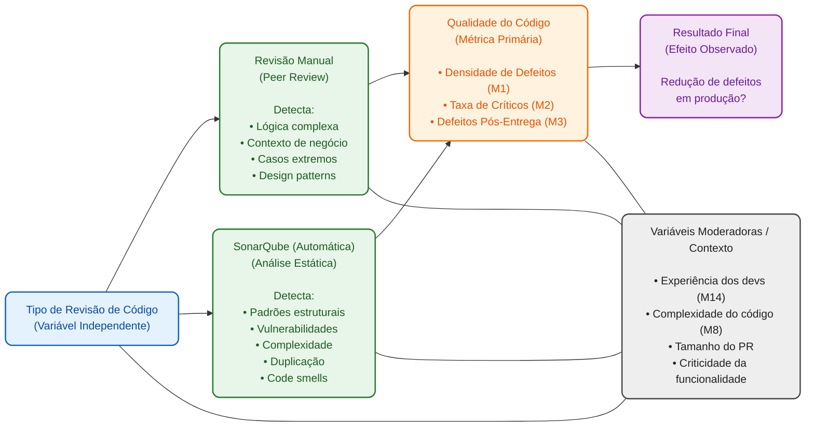
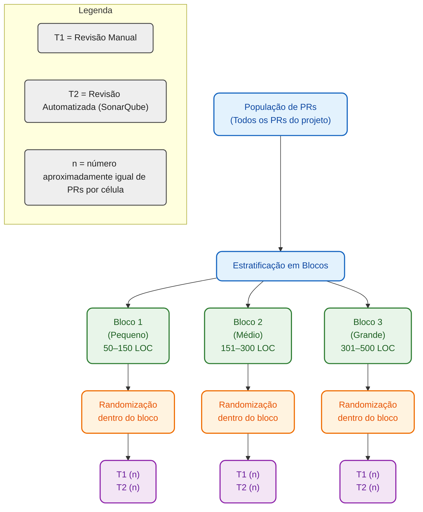
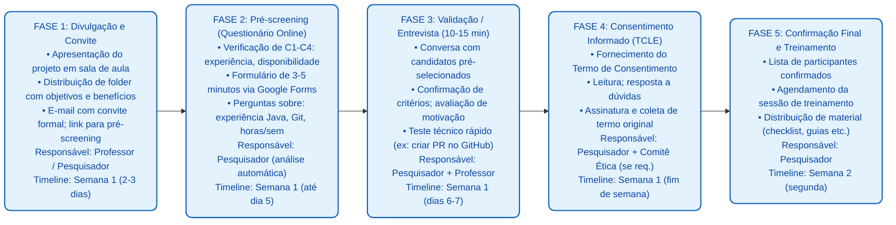
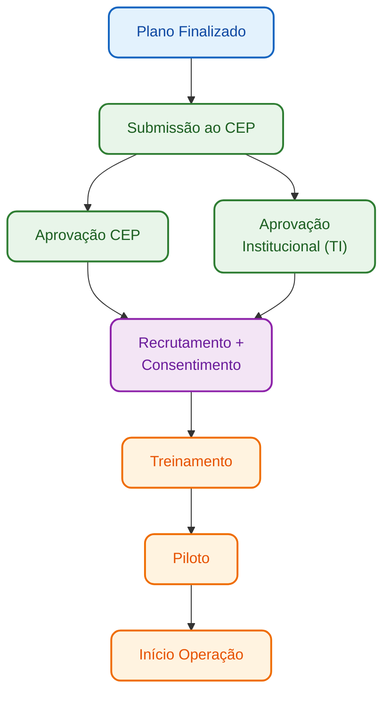

# Proposta de Experimento para Trabalho de Conclusão de Curso (TCC)

## 1. Identificação básica

### 1.1 Título do experimento
Comparação entre revisão de código manual (peer review) e revisão automatizada por SonarQube na redução da densidade de defeitos em projetos Java.

### 1.2 ID / código
## 10. População, sujeitos e amostragem (resumo)

- População-alvo: desenvolvedores que usam Java/Spring Boot em equipes pequenas (4–6 pessoas), contextos acadêmicos prioritários.
- Elegibilidade: matriculado na disciplina, ≥6 meses Java, acesso a GitHub, disponibilidade ~3–4 h/sem.; consentimento (TCLE).
- Exclusões: experiência insuficiente, indisponibilidade, conflitos de interesse, retirada voluntária.
- Amostra pragmática: 30–50 PRs totais (meta ideal 50+); 15–25 PRs por tratamento; balanceamento por tamanho/complexidade/autores.
- Recrutamento: convite em sala, pré‑screening online, entrevista curta, assinatura TCLE; treinamento único (≈3 h) antes do início.

Critérios, fluxos de seleção, módulos de treinamento e cronograma detalhados estão no Apêndice C (recrutamento e treinamento).
### 5.3 Impactos Potenciais no Processo / Produto

#### Durante o experimento:
- Possível aumento inicial de tempo em code review devido ao protocolo estruturado
- Carga adicional na equipe por coleta de dados e pesquisas
- Possível desconforto com mudanças de processo habitual
- Contenção de recursos em ambiente de staging durante testes

#### Após o experimento:
- Recomendações fundamentadas sobre estratégia de revisão a adotar
- Melhor compreensão dos pontos fortes de cada abordagem
- Potencial adoção de método híbrido (manual + automatizado)
- Aumento de confiança na qualidade do código entregue
- Base para políticas de qualidade em futuras disciplinas/projetos

---

## 6. Riscos de Alto Nível, Premissas e Critérios de Sucesso

### 6.1 Riscos de Alto Nível (Negócio, Técnicos, etc.)

| ID | Risco | Categoria | Probabilidade | Impacto | Mitigation | Contingência |
|---|---|---|---|---|---|---|
| R1 | Indisponibilidade ou falha do SonarQube durante experimento | Técnico | Média | Alto | Usar cloud gratuito com SLA; ter backup local self-hosted | Pausar coleta de dados; ampliar janela de tempo |
| R2 | Baixa adesão da equipe ao protocolo estruturado | Negócio/Pessoas | Alta | Alto | Comunicar claramente benefícios; treinar participantes | Reforçar incentivos; ajustar protocolo se necessário |
| R3 | Falta de defeitos suficientes em produção para validar diferenças | Técnico | Média | Alto | Usar testes rigorosos em staging; considerar defeitos simulados | Ampliar critério de "defeito"; aumentir período experimental |
| R4 | Viés do Hawthorne (comportamento alterado por observação) | Pesquisa | Alta | Médio | Minimizar comunicação sobre métricas durante experimento | Coletar dados retrospectivamente; validar com histórico |
| R5 | Atrito de participantes (desistências, indisponibilidade) | Negócio | Média | Médio | Recrutar com antecedência; ter suplentes preparados | Reduzir escopo; alongar cronograma |
| R6 | Inconsistência na aplicação de critérios de revisão manual | Pesquisa | Alta | Médio | Desenvolver checklist; treinamento de revisores; auditar amostra | Padronizar critérios retrospectivamente; usar média de 2+ revisores |
| R7 | Problemas técnicos em CI/CD ou repositório | Técnico | Média | Médio | Usar infraestrutura confiável (GitHub); backup de dados | Restaurar de backup; repetir análise |
| R8 | Amostra insuficiente de PRs por falta de atividade de desenvolvimento | Negócio | Média | Alto | Estimular fluxo de features; usar sprints curtas | Estender calendário; aceitar N menor com análise mais cautelosa |

---

### 6.2 Critérios de Sucesso Globais (Go / No-Go)

| Critério | Condição | Decisão | Responsável |
|---|---|---|---|
| **C1** | Mínimo 20 PRs por grupo (40 no total) coletados com dados completos | **Go:** ≥40 PRs; **No-Go:** <30 PRs | Pesquisador |
| **C2** | Pelo menos 10+ defeitos pós-entrega identificados (distribuídos entre grupos) para permitir análise estatística significativa | **Go:** ≥10 defeitos totais; **No-Go:** <5 defeitos | QA / Testes |
| **C3** | Taxa de aderência ao protocolo ≥80% (pelo menos 80% dos PRs seguem o método designado) | **Go:** ≥80%; **No-Go:** <60% | Pesquisador |
| **C4** | Dados de todas as 16 métricas coletados com <10% de valores faltantes | **Go:** <10% faltantes; **No-Go:** >20% faltantes | Pesquisador |
| **C5** | Teste t / Mann-Whitney pode ser executado com validade estatística (pressupostos testados) | **Go:** Pressupostos atendidos; **No-Go:** Violações graves | Analista |
| **C6** | Pelos menos 80% dos participantes completam questionário/entrevista qualitativa | **Go:** ≥80%; **No-Go:** <50% | Pesquisador |

**Decisão Final:** Experimento considerado bem-sucedido se **mínimo 5 de 6 critérios** forem atingidos (Go).

---

### 6.3 Critérios de Parada Antecipada (Pré-Execução)

| Situação | Ação | Responsável |
|---|---|---|
| **Reprovação ética** — Comitê de ética não aprova protocolo experimental | **Cancelar** experimento até aprovação ser obtida | Professor / Coordenador |
| **Recursos críticos indisponíveis** — SonarQube ou GitHub indisponíveis por >5 dias consecutivos antes de início | **Adiar** para data posterior; buscar alternativas | Pesquisador + TI |
| **Baixa adesão inicial** — <50% da equipe confirmada na fase de recrutamento | **Revisar escopo** e redimensionar; ou **cancelar** se não viável | Professor / Pesquisador |
| **Mudança significativa de contexto** — Calendário acadêmico alterado; feriados não previstos prolongam gap >6 meses | **Renegociar** cronograma; se impacto muito grande, **cancelar** | Coordenador Acadêmico |
| **Impossibilidade técnica demonstrada** — Stack Java não compatível com SonarQube; ambiente não suporta CI/CD | **Adiar** até resolver; considerar **mudança de tecnologia** | Pesquisador + TI |
| **Conflito de interesses ou viés não mitigável** — Revisor manual é também author do código; resultados confundidos | **Redesenhar amostra** ou **parar experimento** | Professor |

---

## 7. Modelo Conceitual e Hipóteses

### 7.1 Modelo Conceitual do Experimento

#### Diagrama de Influências




#### Mecanismo de Ação Esperado

**Hipótese Conceitual:**

1. **Revisão Manual** funciona melhor para detectar problemas de lógica, contexto de negócio e casos extremos, pois um revisor experiente compreende a intenção e pode identificar fluxos anômalos.

2. **Análise Estática (SonarQube)** funciona melhor para identificar padrões estruturais repetitivos, vulnerabilidades conhecidas, complexidade excessiva e duplicação, pois executa regras consistentes em todo o código.

3. **Esperado (H₁ direcional):** Combinando ambos os métodos, é possível capturar categorias diferentes de problemas, resultando em menor densidade de defeitos pós-entrega que qualquer método isolado.

4. **Incerteza Principal:** Qual método (manual ou automatizado) reduz *mais* defeitos críticos que chegam à produção? Ou não há diferença significativa?

---

### 7.2 Hipóteses Formais (H₀, H₁)

#### Hipótese Principal (Bilateral)

**H₀ (Hipótese Nula):**

Não há diferença estatisticamente significativa na densidade de defeitos pós-entrega entre código revisado manualmente e código revisado automaticamente via SonarQube em projetos Java pequenos/médios.

Formalmente: *μ(Defeitos_Manual) = μ(Defeitos_SonarQube)*

**H₁ (Hipótese Alternativa - Bilateral):**

Existe diferença estatisticamente significativa na densidade de defeitos pós-entrega entre os dois métodos de revisão.

Formalmente: *μ(Defeitos_Manual) ≠ μ(Defeitos_SonarQube)*

---

#### Hipóteses Secundárias (Exploratórias)

| ID | Questão | H₀ | H₁ (Direção Esperada) |
|---|---|---|---|
| H2 | Qual método detecta mais vulnerabilidades de segurança? | Nenhuma diferença em M6/M7 | SonarQube > Manual (automatizado detecta padrões) |
| H3 | Qual método identifica melhor problemas de complexidade? | Nenhuma diferença em M8 | SonarQube > Manual (métrica objetiva) |
| H4 | Qual abordagem gasta menos tempo em revisão? | Tempo Manual = Tempo SonarQube (M10) | SonarQube < Manual (automatizado é mais rápido) |
| H5 | Desenvolvedores confiam mais em qual método? | Confiança Manual = Confiança SonarQube (M14) | Manual ≥ SonarQube (experiência humana) |
| H6 | Qual método resulta em menos ciclos de retrabalho? | Ciclos Manual = Ciclos SonarQube (M11) | SonarQube < Manual (menos ambiguidade) |

---

### 7.3 Nível de Significância e Considerações de Poder

#### Nível de Significância (α)

**α = 0.05** (confiança de 95%)

**Justificativa:** Nível padrão em pesquisa de Engenharia de Software; oferece balanço aceitável entre risco de erro Tipo I (rejeitar H₀ quando verdadeira) e Tipo II (não rejeitar H₀ quando falsa).

---

#### Considerações de Poder Estatístico

| Parâmetro | Valor | Justificativa |
|---|---|---|
| **Poder (1 - β)** | 0.80 (80%) | Padrão em pesquisa aplicada; β = 0.20 (risco aceitável de Erro Tipo II) |
| **Tamanho de Efeito (d de Cohen)** | ≥ 0.5 | Efeito médio; diferenças práticas entre métodos devem ser detectáveis |
| **Tamanho de Amostra Planejado (n)** | ~20-30 PRs por grupo (40-60 total) | Baseado em cálculo a posteriori para poder 0.80, α=0.05, d=0.5 |
| **Teste Estatístico** | Teste t de Student (two-tailed) ou Mann-Whitney U (não-paramétrico) | t apropriado para N > 15; Mann-Whitney se pressupostos de normalidade violados |

---

#### Análise de Poder Prognóstica

**Cálculo Estimado (usando G*Power ou fórmula de Cohen):**

Para teste t independente com:
- α = 0.05 (two-tailed)
- Poder = 0.80
- d = 0.5 (efeito médio)

**N necessário ≈ 64 por grupo** (128 total para máxima precisão)

**Realidade do projeto:**
- N planejado = 20-30 PRs por grupo (~40-60 total)
- Poder esperado ≈ 0.60-0.70 (reduzido, mas aceitável em pesquisa aplicada)
- **Implicação:** Estudo tem poder moderado; diferenças pequenas (d < 0.3) podem não ser detectadas; intervalos de confiança serão mais largos

**Mitigação:**
- Priorizar detecção de efeitos de tamanho médio ou maior (d ≥ 0.5)
- Relatar intervalos de confiança (IC 95%) além de p-values
- Usar análise de tamanho de efeito (Cohen's d, η²) para complementar testes clássicos
- Justificar conclusões conservadoras quando poder é limitado

---

#### Pressupostos Estatísticos a Testar

Antes de aplicar teste t, serão validados:

1. **Normalidade:** Teste de Shapiro-Wilk ou gráfico Q-Q para cada grupo
2. **Homogeneidade de Variâncias:** Teste de Levene
3. **Independência:** Garantida pelo design (amostras aleatórias, grupos distintos)

Se pressupostos forem violados:
- Usar **teste Mann-Whitney U** (não-paramétrico, mais robusto)
- Aplicar **transformações logarítmicas** aos dados se apropriado
- Reportar tanto teste paramétrico quanto não-paramétrico


## 8. Variáveis, fatores, tratamentos e objetos de estudo

### 8.1 Objetos de estudo

Os objetos de estudo neste experimento são **Pull Requests (PRs)** contendo implementações de features ou correções de bugs em código Java. Cada PR representa uma unidade experimental que será submetida a um dos dois métodos de revisão.

**Características dos objetos:**

- **Tipo:** Pull Requests no GitHub contendo código-fonte Java
- **Escopo funcional:** Implementações de user stories, features de backend (REST APIs, lógica de negócio, persistência de dados)
- **Tamanho esperado:** PRs com 50-500 linhas de código modificadas (LOC)
- **Complexidade:** Variada — desde CRUDs simples até lógica de negócio com regras condicionais complexas
- **Framework:** Spring Boot 3.x com Java 17+
- **Repositório:** Código versionado no GitHub com histórico completo de commits, comentários e iterações

---

### 8.2 Sujeitos / participantes (visão geral)

**Perfil dos participantes:**

| Aspecto | Descrição |
|---|---|
| **Função** | Estudantes de graduação em Ciência da Computação/Engenharia de Software atuando como desenvolvedores e revisores |
| **Quantidade** | 4-6 participantes (equipe única) |
| **Experiência com Java** | Mista: 6-18 meses de experiência prática; pelo menos 1 disciplina de Programação Orientada a Objetos concluída |
| **Experiência com Git/GitHub** | Básica a intermediária; todos devem saber criar branches, PRs e realizar code review |
| **Experiência com Spring Boot** | Pelo menos 1 projeto acadêmico prévio |
| **Conhecimento de SonarQube** | Não obrigatório (será fornecido treinamento) |

---

### 8.3 Variáveis independentes (fatores) e seus níveis

| Fator | Descrição | Níveis (Tratamentos) | Tipo |
|---|---|---|---|
| **F1: Método de Revisão** | Estratégia utilizada para revisar o código antes da integração | **Nível 1:** Revisão Manual (Peer Review) <br> **Nível 2:** Revisão Automatizada (SonarQube) | Categórico (2 níveis) |

**Detalhamento do fator F1:**

**Nível 1 — Revisão Manual (Peer Review):**
- Revisor humano designado analisa o código linha a linha
- Utiliza checklist padronizado (lógica, legibilidade, boas práticas, segurança, casos extremos)
- Deixa comentários diretamente no GitHub PR
- Aprova ou solicita mudanças com justificativa
- **Não utiliza** ferramentas automatizadas durante a revisão

**Nível 2 — Revisão Automatizada (SonarQube):**
- Análise estática executada automaticamente via CI/CD (GitHub Actions)
- Relatório SonarQube gerado com issues categorizadas (bugs, vulnerabilities, code smells, coverage, duplicação)
- Autor do PR corrige problemas identificados pela ferramenta
- Aprovação automática se quality gate for atingido (configuração padrão: sem bugs críticos, cobertura mínima)
- **Não há** revisão humana adicional neste grupo

---

### 8.4 Tratamentos (condições experimentais)

| Tratamento | Descrição Completa | Protocolo |
|---|---|---|
| **T1: Controle (Revisão Manual)** | PR passa por revisão humana tradicional sem uso de ferramentas automatizadas | 1. Desenvolvedor abre PR no GitHub <br> 2. Revisor humano designado recebe notificação <br> 3. Revisor analisa código usando checklist padronizado <br> 4. Revisor deixa comentários e aprova ou solicita mudanças <br> 5. Autor corrige e atualiza PR (se necessário) <br> 6. Após aprovação, PR é mergeado <br> 7. Código é testado em staging/homologação |
| **T2: Tratamento (Revisão Automatizada SonarQube)** | PR passa por análise estática automática; aprovação baseada em quality gate da ferramenta | 1. Desenvolvedor abre PR no GitHub <br> 2. GitHub Actions dispara análise SonarQube automaticamente <br> 3. Relatório é gerado com issues identificadas <br> 4. Autor analisa relatório e corrige problemas críticos <br> 5. PR é atualizado; nova análise é executada <br> 6. Quality gate aprovado → PR é mergeado <br> 7. Código é testado em staging/homologação |

---

### 8.5 Variáveis dependentes (respostas)

| ID | Nome da Variável | Descrição | Unidade de Medida | Forma de Coleta | Métrica Associada |
|---|---|---|---|---|---|
| **VD1** | **Densidade de Defeitos Pós-Entrega** | Número de defeitos encontrados em staging/homologação após o merge do PR, normalizados por 1.000 linhas de código | defeitos/KLOC | Rastreamento de issues no GitHub + análise de logs de testes | M1 |
| **VD2** | **Taxa de Defeitos Críticos** | Percentual de defeitos com severidade crítica ou alta em relação ao total de defeitos encontrados | % | Classificação manual de severidade nos issues reportados | M2 |
| **VD3** | **Defeitos Pós-Entrega (Absoluto)** | Número absoluto de defeitos identificados após merge (sem normalização) | quantidade | Contagem de issues criados após merge do PR | M3 |
| **VD4** | **Vulnerabilidades Detectadas** | Número total de vulnerabilidades de segurança identificadas durante a revisão (manual ou automatizada) | quantidade | Comentários de revisão manual + relatório SonarQube (Security Hotspots) | M6 |
| **VD5** | **Complexidade Ciclomática Média** | Média da complexidade ciclomática das funções/métodos no código do PR | índice | Relatório SonarQube (Complexity metrics) | M8 |
| **VD6** | **Duplicação de Código** | Percentual de linhas duplicadas identificadas no PR | % | Relatório SonarQube (Duplication metrics) | M9 |
| **VD7** | **Tempo de Revisão** | Tempo total gasto desde a abertura do PR até a aprovação final | minutos | Diferença entre timestamps (PR opened → approved) no GitHub API | M10 |
| **VD8** | **Ciclos de Retrabalho** | Número de iterações (pushes após comentários) necessárias antes da aprovação | quantidade | Contagem de commits após primeira revisão | M11 |
| **VD9** | **Número de Comentários** | Quantidade total de comentários deixados durante a revisão (manual) ou issues flagadas (automatizada) | quantidade | GitHub PR comments API + SonarQube issues count | M12 |
| **VD10** | **Satisfação Percebida** | Avaliação subjetiva dos desenvolvedores sobre a utilidade do método de revisão | escala Likert (1-5) | Questionário pós-experimento | M13 |
| **VD11** | **Confiança no Método** | Grau de confiança dos desenvolvedores na capacidade do método de identificar problemas | escala Likert (1-5) | Questionário pós-experimento | M14 |
| **VD12** | **True Positive Rate** | Percentual de problemas identificados na revisão que correspondem a defeitos reais validados em testes | % | Validação cruzada: issues revisão vs. defeitos em staging | M5 |
| **VD13** | **Severity Distribution** | Distribuição de defeitos pós-entrega por nível de severidade (crítico, alto, médio, baixo) | % por severidade | Classificação manual dos issues reportados | M4 |
| **VD14** | **Feedback Qualitativo** | Temas, insights e observações coletadas em entrevistas/questionários abertos | texto/temas codificadas | Transcrições de entrevistas semi-estruturadas | M16 |

#### Variáveis Dependentes Primárias (Principal Analysis)

As seguintes variáveis serão o **foco principal** da análise estatística para teste de hipóteses:

1. **VD1 (Densidade de Defeitos Pós-Entrega)** — métrica primária para H₀/H₁
2. **VD2 (Taxa de Defeitos Críticos)** — complementa análise de qualidade
3. **VD7 (Tempo de Revisão)** — eficiência do processo

#### Variáveis Dependentes Secundárias (Exploratory Analysis)

Variáveis complementares para análise exploratória e discussão qualitativa:

- VD4, VD5, VD6 — caracterização de problemas detectados
- VD8, VD9 — dinâmica do processo de revisão
- VD10, VD11 — percepção e aceitação dos métodos
- VD12 — validação da qualidade da detecção
- VD13, VD14 — análise detalhada de severidade e feedback qualitativo

---

### 8.6 Variáveis de controle / bloqueio

Variáveis que serão **mantidas constantes** ou usadas para **formação de blocos** a fim de reduzir variabilidade não relacionada ao tratamento:

| ID | Nome da Variável | Descrição | Estratégia de Controle | Justificativa |
|---|---|---|---|---|
| **VC1** | **Tamanho do PR (LOC)** | Número de linhas de código modificadas no PR | **Bloqueio:** PRs serão agrupados em 3 blocos por tamanho (pequeno: 50-150 LOC; médio: 151-300 LOC; grande: 301-500 LOC). Alocação balanceada entre tratamentos dentro de cada bloco. | Tamanho influencia tempo de revisão e probabilidade de defeitos |
| **VC2** | **Complexidade da Feature** | Nível de complexidade da funcionalidade implementada (simples/média/complexa) | **Bloqueio:** Features classificadas em 3 níveis; distribuição equilibrada entre T1 e T2 | Complexidade afeta densidade de defeitos independentemente do método de revisão |
| **VC3** | **Experiência do Desenvolvedor** | Tempo de experiência com Java (em meses) | **Controle:** Rodízio de autores entre tratamentos; cada desenvolvedor contribui com PRs em ambos os grupos | Desenvolvedores mais experientes tendem a produzir menos defeitos |
| **VC4** | **Configuração do SonarQube** | Regras e quality gate utilizados | **Controle:** Configuração padrão do SonarQube mantida constante durante todo o experimento | Variações nas regras distorceriam comparação |
| **VC5** | **Checklist de Revisão Manual** | Critérios utilizados na revisão humana | **Controle:** Checklist padronizado fornecido a todos os revisores; treinamento inicial | Padronização garante comparabilidade entre revisores |
| **VC6** | **Ambiente de Testes** | Infraestrutura de staging/homologação | **Controle:** Mesmo ambiente usado para todos os PRs; configuração fixa | Diferenças de ambiente podem mascarar ou criar defeitos artificialmente |
| **VC7** | **Sprint / Período Temporal** | Momento em que o PR é desenvolvido | **Bloqueio:** Análise estratificada por sprint; efeitos de aprendizagem controlados | Equipe pode melhorar ao longo do tempo (maturação) |
| **VC8** | **Tipo de Funcionalidade** | Categoria da feature (CRUD, API REST, regra de negócio, etc.) | **Bloqueio:** Tipos funcionais balanceados entre tratamentos | Diferentes tipos têm perfis de risco distintos |

---

### 8.7 Possíveis variáveis de confusão conhecidas

Fatores que podem distorcer os resultados e que serão **monitorados** e/ou **mitigados**:

| ID | Variável de Confusão | Descrição do Risco | Impacto Potencial | Estratégia de Mitigação | Monitoramento |
|---|---|---|---|---|---|
| **CF1** | **Efeito Hawthorne** | Participantes alteram comportamento por saberem que estão sendo observados | Desenvolvedores podem caprichar mais na qualidade do código, reduzindo defeitos artificialmente | • Minimizar comunicação sobre métricas durante experimento <br> • Não revelar qual PR está em qual grupo <br> • Coletar dados de forma discreta | Análise retrospectiva de padrões comportamentais |
| **CF2** | **Aprendizado / Maturação** | Equipe melhora habilidades ao longo do tempo | Defeitos podem diminuir naturalmente com o tempo, independente do tratamento | • Controlar por sprint (VC7) <br> • Alternar tratamentos ao longo do tempo <br> • Análise de tendência temporal | Gráficos de densidade de defeitos por semana |
| **CF3** | **Viés de Seleção de Tarefas** | Tarefas mais complexas podem ser alocadas desproporcionalmente a um grupo | Grupo com tarefas mais difíceis apresenta mais defeitos por natureza da tarefa | • Randomização da alocação de PRs <br> • Bloqueio por complexidade (VC2) <br> • Registro da complexidade percebida | Verificação de balanceamento pós-alocação |
| **CF4** | **Diferenças entre Revisores** | Revisores manuais têm estilos e níveis de rigor diferentes | Variabilidade na qualidade da revisão manual (T1) | • Treinamento padronizado <br> • Checklist obrigatório (VC5) <br> • Rodízio de revisores entre PRs <br> • Auditoria de amostra de revisões | Análise de concordância inter-revisor |
| **CF5** | **Qualidade dos Testes em Staging** | Testes de validação podem variar em rigor | Defeitos podem não ser detectados por testes fracos, não por falha do método de revisão | • Padronizar suíte de testes <br> • Cobertura mínima exigida (80%) <br> • Casos de teste pré-definidos para cada feature | Análise de cobertura de testes por PR |
| **CF6** | **Falhas Técnicas Temporárias** | SonarQube pode ficar indisponível; CI/CD pode falhar | PRs do grupo T2 podem não receber análise adequada | • Monitoramento de uptime do SonarQube <br> • Política de re-análise em caso de falha <br> • Backup de dados de análise | Logs de falhas técnicas com timestamps |


---

## 9. Desenho experimental

### 9.1 Tipo de desenho (completamente randomizado, blocos, fatorial, etc.)

**Desenho escolhido:** **Desenho em Blocos Randomizados (Randomized Block Design)**

**Estrutura do desenho:**


---

### 9.2 Randomização e alocação

**Processo de randomização:**

A randomização será realizada **dentro de cada bloco** para garantir balanceamento e reduzir viés.

**Etapas práticas:**

1. **Classificação inicial de PRs:**
   - No momento da abertura do PR, o pesquisador/facilitador registra:
     - Número de LOC modificadas (via GitHub API)
     - Complexidade estimada da feature (via discussão com autor ou análise do título/descrição)
     - Tipo de funcionalidade (CRUD, API, lógica de negócio, etc.)

2. **Alocação ao bloco:**
   - PR é alocado ao bloco correspondente baseado no tamanho (LOC)
   - Bloco 1: 50-150 LOC
   - Bloco 2: 151-300 LOC
   - Bloco 3: 301-500 LOC

3. **Randomização do tratamento:**
   - Dentro de cada bloco, PRs são randomizados para T1 ou T2 usando gerador de números aleatórios
   - **Ferramenta:** Script Python com `random.choice(['T1', 'T2'])` ou planilha com função `=ALEATÓRIO()`
   - **Restrição de balanceamento:** Se diferença entre T1 e T2 dentro do bloco exceder 2 PRs, próximo PR é alocado ao grupo menor para forçar equilíbrio

4. **Registro da alocação:**
   - Tabela mestre mantida em planilha segura:
```
     PR_ID | LOC | Complexidade | Bloco | Tratamento | Data_Abertura
```
   - Apenas pesquisador tem acesso à alocação completa (cegamento parcial dos participantes)

### 9.3 Balanceamento e contrabalanço

**Balanceamento:**

Estratégias para garantir que os grupos (T1 e T2) sejam comparáveis:

1. **Balanceamento de tamanho de amostra:**
   - **Meta:** N_T1 ≈ N_T2 dentro de cada bloco (diferença máxima de 1-2 PRs)
   - **Mecanismo:** Randomização com restrição (seção 9.2)
   - **Verificação:** Contagem periódica (semanal) de PRs por tratamento/bloco

2. **Balanceamento de complexidade:**
   - PRs complexos distribuídos uniformemente entre T1 e T2
   - Classificação de complexidade (simples/média/alta) realizada por 2 avaliadores independentes
   - Se discordância, consenso via discussão

3. **Balanceamento de autores:**
   - Cada desenvolvedor contribui com PRs em **ambos** os tratamentos
   - Rodízio forçado: se desenvolvedor X já tem 3 PRs em T1, próximo PR dele é alocado a T2
   - **Tabela de rastreamento:**
 Desenvolvedor | PRs_T1 | PRs_T2 | Diferença
 Dev_A         |   3    |   2    |    +1
 Dev_B         |   2    |   3    |    -1

4. **Balanceamento temporal:**
   - Ambos os tratamentos aplicados em todas as sprints (não concentrar T1 no início e T2 no final)
   - Alternância entre sprints se possível

**Contrabalanço (para controlar efeitos de ordem/aprendizagem):**

Embora o desenho não seja crossover (cada PR recebe apenas 1 tratamento), aplicamos contrabalanço para outros fatores:

1. **Ordem de exposição dos desenvolvedores aos tratamentos:**
   - **Problema:** Desenvolvedores podem aprender com SonarQube e depois escrever código melhor na revisão manual
   - **Solução:** Alternar ordem de exposição:
     - Metade dos desenvolvedores inicia com T1 (manual), depois T2 (automatizado)
     - Outra metade inicia com T2, depois T1
   
2. **Sequência de revisores manuais:**
   - **Problema:** Mesmo revisor pode ficar mais rigoroso ou relaxado ao longo do tempo
   - **Solução:** Rodízio sistemático de revisores em T1; cada revisor atua em PRs de diferentes blocos e sprints

3. **Ordem de testes em staging:**
   - **Problema:** Testadores podem ficar mais atentos após encontrar defeitos
   - **Solução:** Aleatorizar ordem de teste dos PRs em staging (não testar todos T1 primeiro, depois T2)

---
### 9.4 Número de grupos e sessões

**Número de grupos experimentais:**

- **2 grupos de tratamento:**
  - Grupo 1 (T1): Revisão Manual
  - Grupo 2 (T2): Revisão Automatizada (SonarQube)

- **3 blocos** (por tamanho de PR):
  - Bloco 1: Pequeno (50-150 LOC)
  - Bloco 2: Médio (151-300 LOC)
  - Bloco 3: Grande (301-500 LOC)

- **Total de células experimentais:** 2 tratamentos × 3 blocos = **6 células**

---
## 10. População, sujeitos e amostragem

### 10.1 População-alvo

A **população-alvo** deste experimento é definida como:

> Desenvolvedores que trabalham com **Java e Spring Boot**, atuando em **equipes pequenas/médias (4-6 pessoas)** de desenvolvimento de software, em contextos acadêmicos ou industriais, que realizam revisão de código como prática de garantia de qualidade.
---

### 10.2 Critérios de inclusão de sujeitos

Um participante é **elegível** se atender a TODOS os critérios abaixo:

| Critério | Descrição | Verificação |
|---|---|---|
| **C1: Matriculado na disciplina** | Aluno regularmente matriculado em Engenharia de Software ou disciplina equivalente | Lista oficial da instituição |
| **C2: Experiência com Java** | Mínimo 6 meses de experiência prática com Java (documentado em CV ou projeto anterior) | Entrevista / verificação de projetos anteriores |
| **C3: Experiência com Git/GitHub** | Capacidade de criar branches, fazer commits, abrir PRs e fazer code review básico | Teste prático ou portfolio de commits no GitHub |
| **C4: Disponibilidade de tempo** | Disponibilidade de 3-4 horas/semana para participar do experimento (desenvolvimento, revisão, coleta de dados) | Assinatura de termo de compromisso; verificação de calendário |
| **C5: Consentimento informado** | Leitura e assinatura do termo de consentimento (TCLE) explicando objetivos, riscos e benefícios | Documento assinado antes do início |
| **C6: Acesso a ferramentas** | Tem acesso a computador com Internet, Git instalado e acesso ao repositório GitHub do projeto | Verificação prévia de acesso |

---

### 10.3 Critérios de exclusão de sujeitos

Um participante é **excluído** se apresentar QUALQUER uma das condições abaixo:

| Critério | Descrição | Impacto na Exclusão |
|---|---|---|
| **E1: Experiência insuficiente** | Menos de 6 meses de experiência com Java | Risco de não conseguir completar tarefas; viés na qualidade do código |
| **E2: Indisponibilidade comprovada** | Menos de 3 horas/semana disponíveis durante o período experimental (férias, trabalho externo, conflitos) | Impossibilidade de participar adequadamente; dados incompletos |
| **E3: Conflito de interesse** | Membro da equipe de suporte técnico/TI que poderia manipular ferramentas; alguém com interesse corporativo em resultado específico | Viés na coleta de dados; comprometimento da integridade científica |
| **E4: Restrição ética/legal** | Menores de idade sem consentimento de responsável; indivíduos com restrições de privacidade ou legal | Violação de normas éticas; impossibilidade de prosseguir |
| **E5: Desempenho insuficiente no pré-teste** | Se houver teste técnico inicial e desempenho < 50%, indicando falta de skills críticas | Risco de não compreender protocolo; resultados não válidos |
| **E6: Desistência durante experimento** | Participante comunica formalmente que deseja sair do estudo | Coleta de dados incompleta; exclusão a posteriori |
| **E7: Falta de adesão ao protocolo** | Participante não segue protocolo (ex: faz review manual quando deveria usar SonarQube; não registra dados) | Invalidação de dados dessa unidade experimental |
| **E8: Eventos adversos** | Participante sofre incidente de segurança da informação (hack de conta, vazamento de código) | Impossibilidade de garantir confidencialidade dos dados |


---

### 10.4 Tamanho da amostra planejado (por grupo)

#### Cálculo do Tamanho de Amostra

**Objetivos da amostragem:**

1. Detectar diferença **estatisticamente significativa** entre T1 e T2 em VD1 (Densidade de Defeitos)
2. Ter **poder estatístico suficiente** para concluir se H₀ deve ser rejeitada
3. **Balancear** esforço experimental vs. tamanho da amostra

**Parâmetros estatísticos assumidos:**

| Parâmetro | Valor | Fonte/Justificativa |
|---|---|---|
| **Nível de significância (α)** | 0.05 | Padrão em pesquisa; risco de erro Tipo I |
| **Poder estatístico (1-β)** | 0.80 | Padrão recomendado; β=0.20 (erro Tipo II) |
| **Tamanho de efeito esperado (d de Cohen)** | 0.5 | Efeito médio; diferenças práticas que esperamos encontrar |
| **Teste estatístico** | Teste t independente (two-tailed) | Comparação de 2 grupos independentes |
| **Variância (σ)** | Estimada em ~1.2 defeitos/KLOC | Baseada em literatura; estudos prévios de code review |

---

### 10.5 Método de seleção / recrutamento

#### Estratégia de Recrutamento

**Abordagem:** **Amostragem por Conveniência Estruturada** com seleção de participantes elegíveis

**Racional:** 
- Contexto acadêmico obriga uso de alunos disponíveis em disciplina específica
- Não é viável randomização ao nível de participantes (todos precisam participar)
- Randomização ao nível de PRs/tratamentos garante comparabilidade

**Etapas de recrutamento:**



---

### 10.6 Treinamento e preparação dos sujeitos

#### Objetivos do Treinamento

1. **Equalizar conhecimento:** Todos os participantes entendem protocolo e ferramentas
2. **Reduzir viés:** Minimizar variação na aplicação dos métodos
3. **Alinhar expectativas:** Deixar claro que experimento não afeta notas/avaliação
4. **Competência técnica:** Garantir que todos conseguem usar as ferramentas

#### Módulos de Treinamento

**Módulo 1: Visão Geral do Experimento (30 minutos)**

| Tópico | Conteúdo | Duração |
|---|---|---|
| **Objetivos** | Explicar por que estamos comparando revisão manual vs. automatizada | 5 min |
| **Estrutura** | Desenho experimental, grupos, métricas que serão coletadas | 10 min |
| **Cronograma** | Timeline de 6-8 semanas; sprints, datas-chave | 5 min |
| **Confidencialidade** | Segurança dos dados; quem tem acesso; anonimização | 5 min |
| **Engajamento** | Incentivos; como contribuir de forma igualitária | 5 min |

**Módulo 2: Protocolo de Revisão Manual (45 minutos)**

Conteúdo detalhado em seção 11.3.

| Tópico | Conteúdo | Duração | Material |
|---|---|---|---|
| **Checklist de revisão** | Apresentação de critérios de revisão (lógica, legibilidade, segurança, boas práticas) | 15 min | PDF com checklist; exemplos de problemas |
| **Casos de uso** | 3-4 exemplos de PRs; discussão em grupo de como revisar | 15 min | PRs de exemplo (anterior ou fictício) |
| **Feedback efetivo** | Como deixar comentários construtivos no GitHub | 10 min | Template de comentário; boas práticas |
| **Prática hands-on** | Participantes fazem review de PR de treino em tempo real | 5 min | PR de treino preparado; feedback do facilitador |

**Módulo 3: SonarQube e Análise Automatizada (45 minutos)**

| Tópico | Conteúdo | Duração | Material |
|---|---|---|---|
| **Tour de SonarQube** | Demonstração de painel, relatórios, quality gate | 15 min | Tela compartilhada; printscreens anotados |
| **Interpretação de issues** | Explicação de cada categoria (bugs, vulnerabilities, code smells, etc.) | 15 min | Documento com exemplos; referência rápida |
| **Quality gate** | O que significa passar/falhar; o que fazer se falhar | 10 min | Exemplo de relatório com quality gate falho |
| **Prática hands-on** | Participantes analisam relatório SonarQube de projeto teste | 5 min | Projeto teste preparado; discussão |

**Módulo 4: Processo GitHub e CI/CD (30 minutos)**

| Tópico | Conteúdo | Duração | Material |
|---|---|---|---|
| **Workflow padrão** | Fluxo de criar branch → commit → push → abrir PR → merge | 10 min | Diagrama; reprodução ao vivo |
| **Alocação de tratamentos** | "Sua próxima PR será revisada por [método]. Eis o que esperar:" | 10 min | Tabela de próximos PRs; roles de cada um |
| **Registro de dados** | Quais dados serão coletados automaticamente (timestamps, commits, etc.) | 5 min | Planilha de dados (anonimizada) |
| **Suporte técnico** | Como reportar problemas técnicos (SonarQube down, acesso perdido) | 5 min | Contato de suporte; SLA esperado |

**Módulo 5: Ética, Confidencialidade e Direitos dos Participantes (20 minutos)**

| Tópico | Conteúdo | Duração | Material |
|---|---|---|---|
| **Direitos** | Direito de desistir sem penalização; dados serão protegidos | 5 min | Resumo de direitos (em TCLE) |
| **Confidencialidade** | Como dados serão armazenados, quem pode acessar | 5 min | Política de privacidade do projeto |
| **Uso dos dados** | Dados usados apenas para pesquisa; será publicado anonimizado | 5 min | Exemplos de relatórios com anonimização |
| **Contato em caso de dúvida** | Professor, pesquisador, comitê ética | 5 min | Números, e-mails, horários |

---

## 11. Instrumentação e protocolo operacional

### 11.1 Instrumentos de coleta (questionários, logs, planilhas, etc.)

#### Instrumentos primários de coleta de dados

| ID | Instrumento | Descrição | Formato | Variáveis Coletadas | Responsável |
|---|---|---|---|---|---|
| **I1** | **Planilha de Registro de PRs** | Planilha mestre para tracking de todos os PRs do experimento | Google Sheets | PR_ID, Autor, Data_Abertura, LOC, Bloco, Tratamento, Data_Merge, Status | Pesquisador |
| **I2** | **Checklist de Revisão Manual** | Formulário padronizado para revisores humanos preencherem durante análise de PRs em T1 | Google Forms | Critérios de qualidade (lógica, segurança, legibilidade), Comentários, Tempo de revisão, Aprovação/Rejeição | Revisor manual |
| **I3** | **Relatórios SonarQube** | Exports JSON dos relatórios de análise estática para PRs em T2 | JSON (API) | Bugs, Vulnerabilities, Code Smells, Complexity, Duplicação, Coverage | GitHub Actions (automático) |
| **I4** | **Registro de Defeitos Pós-Entrega** | Template de issue no GitHub para reportar defeitos encontrados em staging/produção | GitHub Issues | Defeito_ID, PR_Origem, Severidade, Categoria, Descrição, Reprodução | Testador |
| **I5** | **Logs de Tempo de Revisão** | Script que captura timestamps de eventos no GitHub (PR opened, reviewed, approved, merged) | CSV (GitHub API) | PR_ID, Timestamp_Abertura, Timestamp_Primeira_Revisão, Timestamp_Aprovação, Timestamp_Merge | Script automático |
| **I6** | **Contador de Comentários e Iterações** | Script que conta número de comentários e commits após primeira revisão | CSV (GitHub API) | PR_ID, Num_Comentarios, Num_Commits_Pos_Revisao, Num_Iteracoes | Script automático |
| **I7** | **Questionário de Satisfação (Pós-Experimento)** | Questionário Likert + perguntas abertas sobre percepção dos métodos de revisão | Google Forms | Satisfação (M13), Confiança (M14), Utilidade percebida, Preferências, Sugestões | Participante |
| **I8** | **Entrevista Semi-Estruturada** | Roteiro de entrevista qualitativa para aprofundar percepções individuais | Áudio + Transcrição | Feedback qualitativo (M16), Experiências, Desafios, Aprendizados | Pesquisador (entrevistador) |
| **I9** | **Formulário de Classificação de Complexidade** | Formulário rápido para autor e revisor classificarem complexidade da feature | Google Forms (1 pergunta) | Complexidade percebida (Simples/Média/Alta) | Autor + Revisor |
| **I10** | **Planilha de Validação (True Positives)** | Planilha para cruzar issues de revisão com defeitos reais encontrados em testes | Google Sheets | Issue_ID, Defeito_Correspondente, Validado (Sim/Não/Parcial) | Pesquisador + QA |

#### Instrumentos secundários (documentação e controle)

| ID | Instrumento | Descrição | Formato | Finalidade |
|---|---|---|---|---|
| **I11** | **Termo de Consentimento Livre e Esclarecido (TCLE)** | Documento legal de consentimento dos participantes | PDF assinado | Ética e conformidade |
| **I12** | **Diário de Campo do Pesquisador** | Notas de observação sobre dinâmica do experimento, incidentes, ajustes | Markdown | Contexto qualitativo; análise de ameaças à validade |
| **I13** | **Log de Incidentes Técnicos** | Registro de falhas de ferramentas (SonarQube offline, CI/CD falhando) | Google Sheets | Controle de qualidade dos dados |
| **I14** | **Checklist de Prontidão (Definition of Ready)** | Checklist para verificar se todos os requisitos foram cumpridos antes de iniciar | Checklist (digital) | Governança |

---

### 11.2 Materiais de suporte (instruções, guias)

#### Materiais para participantes

| Material | Descrição | Formato | Público | Momento de Entrega |
|---|---|---|---|---|
| **Guia do Participante** | Documento completo com visão geral do experimento, papéis, responsabilidades, cronograma | PDF (10 páginas) | Todos os participantes | Sessão de treinamento |
| **Checklist de Revisão Manual** | Lista de verificação com critérios padronizados (lógica, segurança, performance, legibilidade, testes) | PDF (2 páginas) | Revisores manuais | Sessão 1 de treinamento |
| **Guia Rápido do SonarQube** | Tutorial visual de como interpretar relatórios, priorizar issues e corrigir problemas | PDF (4 páginas) + vídeo (5 min) | Autores de PRs em T2 | Sessão 2 de treinamento |
| **Template de Descrição de PR** | Modelo padrão para descrição de PRs (contexto, mudanças, testes realizados) | Markdown (arquivo no repo) | Autores de PRs | Início do experimento |
| **Template de Issue de Defeito** | Modelo para reportar defeitos encontrados em staging (passos de reprodução, severidade, screenshots) | Markdown (issue template no GitHub) | Testadores | Início do experimento |
| **Fluxograma do Protocolo Experimental** | Diagrama visual do fluxo completo desde abertura de PR até coleta de dados (ver seção 11.3) | PDF A3 + PNG | Todos os participantes | Sessão 3 de treinamento |
| **FAQ do Experimento** | Perguntas frequentes sobre procedimentos, ferramentas, prazos | Markdown (wiki do GitHub) | Todos os participantes | Disponível continuamente |
| **Glossário de Termos** | Definições de termos técnicos (code smell, technical debt, quality gate, etc.) | PDF (2 páginas) | Todos os participantes | Sessão 2 de treinamento |

#### Materiais para administradores do experimento

| Material | Descrição | Formato | Finalidade |
|---|---|---|---|
| **Manual de Operação do Experimento** | Guia completo para o pesquisador executar o experimento (configuração, coleta, troubleshooting) | Markdown (20 páginas) | Referência operacional |
| **Scripts de Automação** | Coleção de scripts Python/Shell para coletar dados do GitHub API e SonarQube | GitHub repo (`/scripts`) | Automação da coleta |
| **Protocolo de Randomização** | Documento com algoritmo e registro de alocação de PRs aos tratamentos | Markdown + planilha | Auditoria e transparência |
| **Checklist de Verificação Semanal** | Lista de tarefas de monitoramento (conferir aderência, resolver bloqueios, atualizar planilhas) | Checklist (Notion/Trello) | Governança operacional |
| **Roteiro de Entrevista Semi-Estruturada** | Perguntas abertas para explorar percepções dos participantes pós-experimento | Documento Word/PDF | Coleta qualitativa |
| **Plano de Contingência** | Procedimentos para lidar com cenários de risco (desistências, falhas técnicas, baixa adesão) | Markdown | Gestão de riscos |

---

### 11.3 Procedimento experimental (protocolo – visão passo a passo)

#### Fluxograma do Protocolo Experimental


## 11.4 Plano de piloto (se haverá piloto, escopo e critérios de ajuste)

### **Realização de piloto**

**Decisão:** Sim, será realizado um piloto limitado antes da operação completa do experimento.

**Justificativa:**  
O piloto é essencial para:

- Validar a viabilidade operacional do protocolo  
- Identificar gargalos ou ambiguidades nas instruções  
- Testar a funcionalidade dos instrumentos de coleta (formulários, scripts)  
- Calibrar estimativas de tempo e carga de trabalho  
- Ajustar o treinamento dos participantes baseado em dificuldades reais  

---

### **Escopo do piloto**

| Aspecto | Detalhamento |
|--------|--------------|
| **Participantes** | 2–3 desenvolvedores voluntários (preferencialmente não participarão do experimento principal, ou seus dados do piloto serão descartados) |
| **Duração** | 1 sprint (2 semanas) |
| **Número de PRs** | 4–6 PRs no total (2–3 por tratamento) |
| **Cobertura de tratamentos** | Ambos os tratamentos (T1 e T2) |
| **Cobertura de blocos** | Ao menos 2 blocos (Pequeno e Médio) |
| **Ferramentas** | GitHub, SonarQube, CI/CD, formulários, scripts |
| **Coleta completa** | Sim, todos os instrumentos (I1–I10) serão usados |

---

### **Objetivos específicos do piloto**

| Objetivo | Critério de Validação | Método |
|---------|------------------------|--------|
| Validar clareza do protocolo | 100% dos participantes conseguem executar tarefas sem assistência | Observação + questionário pós-piloto |
| Testar instrumentos de coleta | Formulários e scripts funcionam sem erros | Inspeção manual |
| Verificar integração CI/CD + SonarQube | Pipeline sem falhas; relatório em <10 min | Logs técnicos |
| Calibrar tempo de revisão | Estimativa dentro de ±30% do observado | Comparação estimado vs. real |
| Identificar pontos de confusão | Lista de dúvidas dos participantes | Diário do pesquisador |
| Testar checklist de revisão | Checklist sem ambiguidades | análise de consistência |
| Validar randomização | PRs alocados corretamente | Auditoria em I1 |

---

### **Critérios de ajuste do protocolo**

| Problema Identificado | Ajuste Permitido | Ajuste Não Permitido |
|----------------------|------------------|------------------------|
| Instruções ambíguas | Reescrever materiais | Mudar hipóteses |
| Checklist extenso | Ajustar itens | Remover segurança |
| Formulários difíceis | Simplificar perguntas | Remover métricas VD1–VD14 |
| Bugs em scripts | Corrigir | Alterar fonte dos dados |
| Tempo muito alto de revisão | Ajustar estimativas | Reduzir rigor |
| Erros no SonarQube | Ajustar quality gate | Remover tratamento T2 |
| Confusão sobre papéis | Melhorar treinamento | Alterar desenho experimental |
| Defeitos não detectados | Reforçar testes | Aceitar ausência como normal |
| Baixa resposta | Simplificar questionário | Remover qualitativo |
| Variabilidade alta | Reforçar treinamento | Aceitar inconsistência |

---

### **Decisão Go/No-Go pós-piloto**

| Critério | Go | No-Go |
|----------|----|--------|
| Viabilidade técnica | Tudo funciona | Falhas críticas |
| Clareza do protocolo | ≥80% aderência | <60% aderência |
| Qualidade dos dados | Completos e consistentes | >20% faltantes |
| Viabilidade de tempo | Dentro do cronograma | >8 semanas |
| Engajamento | Boa motivação | Resistência |

**Decisão final:** Se **4/5** critérios forem Go → iniciar experimento.  
Se não → ajustes + mini-piloto (1 semana).

---

## 12. Plano de análise de dados (pré-execução)


### 12.1 Estratégia geral de análise

### **Estrutura da análise**

| Questão | Estratégia | Variáveis | Técnica |
|--------|------------|-----------|---------|
| Q1.1 | Comparar densidade de defeitos | VD1, VC1 | t-test / Mann-Whitney / ANOVA |
| Q1.2 | Comparar defeitos pós-entrega | VD3, VD13 | Wilcoxon / χ² |
| Q1.3 | Relação entre issues de revisão e defeitos | VD12, VD9 | Correlação Spearman |
| Q2.1 | Vulnerabilidades identificadas | VD4, M7 | Mann-Whitney |
| Q2.2 | Complexidade | VD5, VD2 | t-test / correlação |
| Q2.3 | Duplicação | VD6, VD1 | t-test / regressão |
| Q3.1 | Tempo de revisão | VD7, LOC | t-test / ANCOVA |
| Q3.2 | Comentários | VD9 | Mann-Whitney |
| Q3.3 | Ciclos de retrabalho | VD8 | Mann-Whitney |
| Q4.1 | Satisfação | VD10, VD14 | Mann-Whitney + qualitativo |
| Q4.2 | Aceitabilidade | VD11, VD15 | Mann-Whitney |
| Q4.3 | Aprendizado | VD14 | Codificação temática |

---

### **Fluxo geral de análise**

## Preparação e limpeza

- Preparação e limpeza dos dados  
- Análise exploratória  
- Teste de pressupostos  
- Testes de hipóteses  
- Tamanho de efeito  
- Análise qualitativa  
- Triangulação  
- Discussão  

---

### 12.2 Métodos estatísticos

### **Testes paramétricos**

| Teste | Aplicação | Condições |
|-------|-----------|-----------|
| t-test | VD1, VD2, VD5, VD6, VD7 | Normalidade + homogeneidade |
| ANOVA | Efeito de tratamento e bloco | Normalidade + balanceamento |
| ANCOVA | Controlar LOC/experiência | Linearidade |
| Regressão linear | VD6 → VD1 | Normalidade dos resíduos |
| Correlação Pearson | VD5 e VD1 | Relação linear |

---

### **Testes não-paramétricos**

| Teste | Aplicação |
|-------|-----------|
| Mann-Whitney | Comparação entre grupos |
| Kruskal-Wallis | Alternativa à ANOVA |
| Spearman | Correlação ordinal |
| χ² | Distribuições categóricas |
| Fisher | n pequeno |

---

### **Tamanho de efeito**

| Medida | Quando usar |
|--------|-------------|
| Cohen d | Testes paramétricos |
| r | Mann-Whitney |
| η² | ANOVA |
| V de Cramér | χ² |

---

### 12.3 Dados faltantes e outliers

### **Dados faltantes**

| Cenário | Ação |
|---------|------|
| MCAR <5% | Listwise deletion |
| MCAR 5–10% | Imputação simples |
| MCAR >10% | Multiple Imputation |
| MNAR | Sensibilidade |
| VD1 faltante | Excluir |
| Covariável faltante | Imputação por regressão |

---

### **Outliers**

| Tipo | Ação |
|------|------|
| Legítimo | Incluir + análise de sensibilidade |
| Erro | Corrigir ou excluir |
| Influente | Reportar com/sem |
| Secundário | Winsorizar |
| >10% no grupo | Investigar processo |

---

### 12.4 Análise qualitativa

### **Fontes**

- Respostas abertas (I7)  
- Entrevistas (I8)  
- Comentários de revisão (I2)  
- Diário de campo (I12)  

---

### **Método: Análise Temática (Braun & Clarke)**

1. Familiarização  
2. Codificação inicial  
3. Busca de temas  
4. Revisão  
5. Nomeação e definição  
6. Relatório final  

---

### **Técnicas**

- Contagem de frequência  
- Co-ocorrência  
- Comparação entre tratamentos  
- Análise de sentimento  
- Word cloud  

---

### **Rigor**

| Critério | Estratégia |
|----------|------------|
| Credibilidade | Triangulação, member checking |
| Transferibilidade | Descrição rica |
| Confiabilidade | Duplo codificador + Kappa > 0.7 |
| Confirmabilidade | Audit trail |

---

### **Triangulação**

| Cenário | Interpretação |
|---------|--------------|
| Convergência | Mesma direção |
| Complementaridade | Quali explica quanti |
| Divergência | Resultados conflitantes |
| Silêncio | Algo aparece só em um dos tipos |

---

## 13. Avaliação de validade (ameaças e mitigação)

### 13.1 Validade de conclusão
**Definição:** Validade de conclusão refere-se à robustez das inferências estatísticas sobre relação entre tratamento e resposta. Ameaças comprometem a capacidade de detectar efeitos reais ou levam a conclusões errôneas sobre significância.

## Ameaças identificadas e estratégias de mitigação

### C1 — Baixo poder estatístico
- **Risco:** Amostra pequena (n=40-60 PRs) reduz poder para detectar diferenças  
- **Impacto:** Erro Tipo II  
- **Mitigação:**  
  - Priorizar detecção de efeitos médios/grandes (d≥0.5)  
  - Usar testes não-paramétricos  
  - Reportar tamanho de efeito + IC95%  
  - Aceitar poder moderado (0.60-0.70) como limitação  
- **Monitoramento:** Cálculo de poder post-hoc; análise de sensibilidade

### C2 — Violação de pressupostos estatísticos
- **Risco:** Dados não-normais, variâncias heterogêneas  
- **Impacto:** p-values incorretos  
- **Mitigação:**  
  - Testes Shapiro-Wilk, Levene  
  - Testes não-paramétricos  
  - Transformações (log, Box-Cox)  
  - Reportar paramétrico + não-paramétrico  
- **Monitoramento:** Verificação de pressupostos e gráficos diagnósticos

### C3 — Confiabilidade de medidas
- **Risco:** Erro de medição em defeitos e timestamps  
- **Impacto:** Ruído obscurece sinal real  
- **Mitigação:**  
  - Scripts automáticos  
  - Auditoria manual de 20%  
  - Protocolos claros  
- **Monitoramento:** Auditoria e verificação de consistência

### C4 — Pesca de significância (p-hacking)
- **Mitigação:**  
  - Hipóteses definidas a priori  
  - Bonferroni (>5 testes)  
  - α=0.01 para exploratórios  
  - Reportar todos os testes  
- **Monitoramento:** Registro pré-análise

### C5 — Variabilidade da implementação do tratamento
- **Mitigação:**  
  - Treinamento padronizado  
  - Checklist obrigatório  
  - Configuração SonarQube congelada  
- **Monitoramento:** Logs semanais, auditoria

### C6 — Heterogeneidade de variância
- **Mitigação:**  
  - Teste t de Welch  
  - Teste de Levene  
  - Transformações  
- **Monitoramento:** Análise de resíduos

### C7 — Outliers influentes
- **Mitigação:**  
  - Sensibilidade com/sem outliers  
  - Mediana + Mann-Whitney  
  - Verificar causa  
- **Monitoramento:** Boxplots e Cook’s Distance

### C8 — Tamanho de amostra desbalanceado
- **Mitigação:**  
  - Randomização com balanceamento  
  - Monitoramento semanal  
  - Recrutar suplentes  
- **Monitoramento:** n_T1 vs n_T2 semanal

---

### 13.2 Validade interna (causalidade)

**Mitigações para 10 ameaças:** História, maturação, Hawthorne, instrumentação, seleção, atrito, contaminação, rivalidade, demoralização, história local.

- **Controles:** Período curto (6-8 sem.); análise por sprint; Kappa > 0.7; randomização com bloqueio; suplentes; cegamento parcial; análise temporal
- **Monitoramento:** Diário de campo; logs semanais; gráficos de tendência; auditoria 20%

---

### 13.3 Validade de constructo (operacionalização)

### CT1 — Inadequação
- **Mitigação:** Múltiplas métricas VDs; Triangulação

### CT2 — Múltiplos métodos
- **Mitigação:** Quanti + quali integrados

### CT4 — Rigor
- **Mitigação:** Definição clara; Kappa > 0.7; coleta automática


---

### 13.4 Validade externa (generalização)

**Limitações da pesquisa:**
- Contexto acadêmico; não generaliza para corporações
- Tamanho pequeno; não generaliza para projetos maiores
- Linguagem Java específica
- Período curto (6-8 semanas)
- Sem pressão competitiva real

**Pode generalizar para:** Equipes ágeis pequenas, projetos backend Java/C#, código novo

---

### 13.5 Resumo executivo: Top 5 ameaças críticas

| # | Ameaça | Impacto | Mitigação Primária | Status |
|---|--------|---------|--------|--------|
| 1 | **Baixo poder** (n=40-60) | Erro Tipo II | IC95% + d; testes não-param | ✅ Monit. post-hoc |
| 2 | **Maturação** (progresso dev) | Confusão com trat | Análise por sprint | ✅ Gráficos |
| 3 | **Reatividade** (Hawthorne) | Comportamento alterado | Coleta automática; cegamento | ✅ Análise temporal |
| 4 | **Contexto acadêmico** | Impossível generalizar ind | Limites claros na discussão | ⚠️ Amostra diversa |
| 5 | **Ambiguidade defeito** | Inconsistência class | Definição clara; Kappa > 0.7 | ✅ Validação dupla |

**Plano de mitigação integrado:**
- **Pré-execução:** Piloto, treinamento, definição de hipóteses, Kappa baseline
- **Durante:** Monitoramento semanal, diário de campo, auditoria 20%, re-treinamento
- **Pós:** Análise de sensibilidade, teste pressupostos, discussão de limitações

---

## 14. Ética, privacidade e conformidade

### 14.1 Questões éticas (uso de sujeitos, incentivos, etc.)

**Questões éticas identificadas:**

**Uso de estudantes como sujeitos de pesquisa:**
- Existe uma relação hierárquica entre pesquisador/professor e estudantes participantes
- Risco de pressão implícita para participação devido à dinâmica acadêmica
- Possível conflito entre objetivos didáticos da disciplina e objetivos da pesquisa

**Incentivos:**
- Não haverá incentivos financeiros ou acadêmicos diretos (pontos extras, etc.)
- Benefício indireto: aprendizado sobre práticas de qualidade de software e métodos empíricos
- Certificado de participação em pesquisa (opcional, apenas para currículo)

---

### 14.2 Consentimento informado

**Processo de obtenção de consentimento:**

**Fase 1: Apresentação inicial (Semana 0)**
- Reunião presencial de 30 minutos para apresentar o estudo
- Slides explicando objetivos, metodologia, riscos, benefícios e direitos dos participantes
- Sessão de perguntas e respostas
- Distribuição do Termo de Consentimento Livre e Esclarecido (TCLE)

**Informações fornecidas no TCLE:**
1. **Título e objetivo do estudo:** Comparação entre revisão manual e automatizada
2. **Procedimentos:** O que os participantes farão (desenvolver, revisar, responder questionários)
3. **Duração:** 6-8 semanas, com estimativa de tempo semanal (4-6 horas)
4. **Riscos mínimos:** Desconforto ao receber críticas; possível aumento de carga de trabalho
5. **Benefícios:** Aprendizado sobre qualidade de software; contribuição para conhecimento científico
6. **Confidencialidade:** Como dados serão anonimizados e protegidos
7. **Voluntariedade:** Direito de recusar ou desistir sem penalização
8. **Contatos:** Email e telefone do pesquisador e do comitê de ética

**Fase 2: Período de reflexão (1 semana)**
- Participantes levam TCLE para casa
- Podem consultar familiares, outros professores, colegas
- Prazo de 7 dias para decisão

**Fase 3: Coleta de consentimento (Semana 1)**
- Assinatura física ou digital do TCLE
- Coleta realizada por assistente de pesquisa (não pelo professor da disciplina)
- Duas vias: uma para participante, outra para arquivo da pesquisa
- Consentimento registrado em planilha segura (acesso restrito)

**Formato do consentimento:**
- Documento de 2-3 páginas em linguagem clara e acessível (evitar jargões)
- Checkbox para cada item lido e compreendido
- Espaço para perguntas adicionais antes da assinatura
- Versão digital com timestamp para rastreabilidade

**Reafirmação de consentimento:**
- Breve lembrete no início de cada sprint sobre direitos dos participantes
- Possibilidade de retirar consentimento via email a qualquer momento

---

### 14.3 Privacidade e proteção de dados

**Dados pessoais coletados:**

| Tipo de Dado | Informação Específica | Sensibilidade | Necessidade |
|---|---|---|---|
| **Identificação** | Nome, matrícula, email | Média | Necessário para rastreamento de PRs e follow-up |
| **Desempenho acadêmico** | Semestre, disciplinas cursadas | Baixa | Caracterização de experiência |
| **Código-fonte** | Repositório GitHub (username visível) | Média | Núcleo do experimento |
| **Métricas de qualidade** | Defeitos, complexidade, tempo de revisão | Média | Variáveis dependentes |
| **Feedback subjetivo** | Respostas de questionários, entrevistas | Média | Dados qualitativos |

**Estratégias de proteção:**

**Anonimização:**
- Cada participante receberá um **código único alfanumérico** (ex: P001, P002, ..., P006)
- Tabela de mapeamento (nome real ↔ código) armazenada separadamente em arquivo criptografado
- Apenas pesquisador principal terá acesso à tabela de mapeamento
- Publicações e relatórios usarão exclusivamente códigos anônimos

**Pseudoanonimização de repositórios:**
- Repositórios serão clonados para ambiente privado de análise
- Usernames do GitHub serão substituídos por códigos antes da análise
- Commits e comentários terão autores mascarados

**Controle de acesso:**
- Dados brutos armazenados em Google Drive com criptografia (2FA ativado)
- Acesso restrito ao pesquisador principal e orientador
- Logs de acesso habilitados
- Compartilhamento com terceiros apenas após anonimização completa

**Retenção de dados:**
- **Durante o experimento:** Dados completos mantidos em servidor seguro
- **Pós-experimento:** Dados anonimizados mantidos por 5 anos para auditoria e replicação
- **Dados identificáveis:** Descartados após 1 ano ou ao final da defesa do TCC (o que ocorrer primeiro)
- **Exclusão sob demanda:** Participantes podem solicitar exclusão total de seus dados até 30 dias após conclusão da coleta

**Conformidade com LGPD (Lei Geral de Proteção de Dados):**
- Base legal: Consentimento explícito (Art. 7º, I) e pesquisa científica (Art. 7º, IV)
- Finalidade específica: Pesquisa acadêmica sobre qualidade de software
- Minimização: Apenas dados estritamente necessários serão coletados
- Transparência: Participantes informados sobre todos os dados coletados e seu uso

**Compartilhamento de dados:**
- Dataset anonimizado pode ser publicado em repositório acadêmico (ex: Zenodo, figshare)
- Apenas com consentimento explícito adicional dos participantes
- Código-fonte não será publicado sem permissão

---

### 14.4 Aprovações necessárias (comitê de ética, jurídico, DPO, etc.)

**Órgãos e aprovações requeridas:**

| Órgão | Tipo de Aprovação | Status Atual | Prazo Estimado | Responsável |
|---|---|---|---|---|
| **Comitê de Ética em Pesquisa (CEP)** | Protocolo de pesquisa com seres humanos | ⏳ Pendente | 30-60 dias | Pesquisador + Orientador |
| **Coordenação do Curso** | Autorização para uso de disciplina | ✅ Aprovado | - | Professor da disciplina |
| **Departamento de TI** | Uso de infraestrutura (servidores, SonarQube) | ⏳ Em análise | 7-14 dias | Pesquisador |
| **Jurídico da Instituição** | Revisão do TCLE e conformidade LGPD | ⏳ Pendente | 14-21 dias | Setor jurídico |
| **DPO (Data Protection Officer)** | Validação de medidas de proteção de dados | ⏳ Pendente | 7 dias | Pesquisador + DPO |

**Documentação necessária para CEP:**

1. **Plataforma Brasil:** Cadastro completo do projeto
2. **Projeto detalhado:** Versão expandida deste documento
3. **TCLE:** Termo de consentimento revisado
4. **Folha de rosto:** Assinada pelo diretor da unidade
5. **Currículo Lattes:** Pesquisador e orientador atualizados
6. **Instrumentos de coleta:** Questionários, roteiros de entrevista, checklists
7. **Declaração de infraestrutura:** Confirmação de disponibilidade de recursos
8. **Cronograma detalhado:** Com previsão de início pós-aprovação

**Processo de submissão ao CEP:**

**Semana -8:** Preparação de documentação
**Semana -7:** Submissão via Plataforma Brasil
**Semana -6 a -2:** Análise pelo CEP; possíveis solicitações de ajustes
**Semana -1:** Aprovação final (estimativa)
**Semana 0:** Início do recrutamento de participantes


---

## 15. Recursos, infraestrutura e orçamento

### 15.1 Recursos humanos e papéis

**Equipe do experimento:**

**1. Pesquisador Principal (Gabriel Ferreira Amaral)**
- **Responsabilidades:**
  - Desenho experimental e definição de hipóteses
  - Coordenação geral do experimento
  - Coleta e análise de dados
  - Preparação de instrumentos (questionários, checklists)
  - Redação de relatórios e publicações
  - Garantia de conformidade ética
- **Dedicação:** 10-15 horas/semana durante 8 semanas
- **Qualificações:** Estudante de TCC em Engenharia de Software; experiência com Java, Git e pesquisa empírica

**2. Orientador Acadêmico (Professor [Danilo Maia])**
- **Responsabilidades:**
  - Supervisão metodológica e científica
  - Revisão de instrumentos e plano de análise
  - Apoio na interpretação de resultados
  - Co-autoria em publicações
  - Mediação de conflitos éticos ou operacionais
- **Dedicação:** 2-3 horas/semana
- **Qualificações:** Mestrado em Engenharia de Software; experiência em métodos empíricos

**3. Participantes / Desenvolvedores (4-6 estudantes)**
- **Responsabilidades:**
  - Desenvolver features em Java/Spring Boot
  - Abrir pull requests seguindo protocolo
  - Realizar revisões manuais (quando designados)
  - Interagir com SonarQube (quando aplicável)
  - Responder questionários e participar de entrevistas
  - Executar testes em staging/homologação
- **Dedicação:** 4-6 horas/semana (integrado ao trabalho normal da disciplina)
- **Qualificações:** Conforme critérios de inclusão (seção 10.2)

**4. Assistente de Pesquisa (Opcional)**
- **Responsabilidades:**
  - Coleta de consentimento informado
  - Organização de dados brutos
  - Suporte técnico em CI/CD e SonarQube
  - Transcrição de entrevistas
- **Dedicação:** 3-5 horas/semana
- **Qualificações:** Estudante de pós-graduação ou graduação avançada com experiência em pesquisa
- **Status:** Desejável, mas não crítico; pesquisador principal pode assumir essas funções se necessário

**5. Especialista em Estatística (Consultor)**
- **Responsabilidades:**
  - Revisão do desenho experimental e cálculo de poder
  - Consultoria na análise estatística (ANOVA, testes de hipóteses)
  - Validação de pressupostos e escolha de testes apropriados
- **Dedicação:** 2-4 horas total (consultorias pontuais)
- **Qualificações:** Professor ou profissional com expertise em estatística aplicada
- **Status:** Consulta pontual; não integrado à equipe

**6. Suporte Técnico de TI (Institucional)**
- **Responsabilidades:**
  - Configuração e manutenção de servidor SonarQube (se self-hosted)
  - Suporte em CI/CD (GitHub Actions)
  - Acesso a ambientes de staging
  - Backup de dados
- **Dedicação:** 1-2 horas/semana (sob demanda)
- **Status:** Dependente de aprovação institucional

**Matriz RACI (Responsável, Aprovador, Consultado, Informado):**

| Atividade | Pesquisador | Orientador | Participantes | Assist. Pesquisa | TI |
|---|---|---|---|---|---|
| Desenho experimental | R/A | C | I | - | - |
| Submissão ao CEP | R | A | - | C | - |
| Recrutamento | R | C | - | R | - |
| Coleta de dados | R | I | R | C | - |
| Revisão de código | I | I | R | - | - |
| Análise estatística | R/A | C | I | - | - |
| Infraestrutura técnica | C | I | I | C | R |
| Publicação | R | A | C | - | - |

---

### 15.2 Infraestrutura técnica necessária

**Repositório e Controle de Versão:**
- **GitHub (Cloud):**
  - Repositório privado com acesso controlado
  - GitHub Actions para CI/CD (quota gratuita: 2.000 minutos/mês)
  - Proteção de branch `main` (requer aprovação de PR)
  - Webhooks para integração com SonarQube
- **Requisitos:** Conta GitHub educacional (gratuita); internet estável

**Análise Estática de Código:**
- **SonarQube:**
  - **Opção 1 (preferencial):** SonarCloud (cloud gratuito para projetos open-source/educacionais)
    - Sem custo; sem manutenção
    - Integração nativa com GitHub
    - Limitações: dados armazenados em servidor terceiro
  - **Opção 2 (alternativa):** SonarQube Community Edition (self-hosted)
    - Servidor Linux com Docker
    - Requisitos: 2 vCPUs, 4 GB RAM, 20 GB disco
    - Vantagem: controle total dos dados
    - Desvantagem: requer manutenção
- **Configuração:** Regras padrão (Sonar Way); quality gate padrão

**Integração Contínua (CI/CD):**
- **GitHub Actions:**
  - Workflows para:
    - Build e testes automatizados (Maven/Gradle)
    - Análise SonarQube (acionada em cada push/PR)
    - Deploy para staging (opcional)
  - Secrets gerenciados via GitHub Secrets
- **Requisitos:** Arquivos `.github/workflows/*.yml` no repositório

**Ambiente de Desenvolvimento:**
- **Local (máquinas dos participantes):**
  - JDK 17+
  - IDE (IntelliJ IDEA Community ou VS Code com extensões Java)
  - Git CLI
  - Maven ou Gradle
- **Padronização:** Dockerfile ou `devcontainer.json` para consistência (opcional)

**Ambiente de Staging/Homologação:**
- **Servidor de testes:**
  - **Opção 1:** Heroku (plano gratuito, limitado)
  - **Opção 2:** Servidor institucional (se disponível)
  - **Opção 3:** Docker local compartilhado via ngrok/tunelamento
- **Requisitos:**
  - Banco de dados de testes (PostgreSQL ou MySQL)
  - Deploy automatizado via CI/CD
  - Logs centralizados (ex: Papertrail, Loggly)
- **Acesso:** URL compartilhada para testes manuais

**Coleta e Armazenamento de Dados:**
- **Google Drive (criptografado):**
  - Planilhas para rastreamento de PRs, métricas, alocações
  - Armazenamento de questionários e transcrições
  - Backup diário automático
- **GitHub API:**
  - Scripts Python para extração de métricas (tempo de revisão, comentários, commits)
  - Biblioteca: `PyGithub` ou `requests`
- **SonarQube API:**
  - Extração de métricas de qualidade (complexidade, duplicação, issues)
  - Biblioteca: `requests` + autenticação via token

**Ferramentas de Análise:**
- **Estatística:**
  - R ou Python (pandas, scipy, statsmodels)
  - Jupyter Notebooks para análise exploratória
- **Visualização:**
  - Matplotlib, Seaborn (Python) ou ggplot2 (R)
  - Tableau Public (opcional, para gráficos de apresentação)

**Comunicação:**
- **Slack ou Discord:**
  - Canal dedicado ao experimento
  - Comunicação assíncrona entre participantes e pesquisador
- **Google Meet / Zoom:**
  - Reuniões semanais de sprint e entrevistas
- **Email:**
  - Comunicações formais (consentimento, cronograma)

**Backup e Redundância:**
- **Dados críticos:**
  - Backup diário automático do Google Drive para disco externo local
  - Repositório Git clonado localmente toda semana
- **Código de análise:**
  - Versionado em repositório Git separado (privado)

**Checklist de infraestrutura (pré-operação):**
- [ ] Repositório GitHub criado com permissões configuradas
- [ ] SonarQube configurado e integrado ao GitHub
- [ ] GitHub Actions workflows testados e funcionais
- [ ] Ambiente de staging disponível e acessível
- [ ] Scripts de coleta de dados desenvolvidos e validados
- [ ] Google Drive estruturado com pastas e permissões
- [ ] Canal de comunicação criado e participantes adicionados
- [ ] Backup automatizado configurado e testado

---

### 15.3 Materiais e insumos

**Materiais digitais (templates e formulários):**

1. **Termo de Consentimento Livre e Esclarecido (TCLE)**
   - Formato: PDF e Google Forms (assinatura digital)
   - Versões: 2 vias (participante + arquivo)

2. **Checklist de Revisão Manual**
   - Formato: Markdown ou PDF
   - Conteúdo: 15-20 itens categorizados (lógica, segurança, legibilidade, boas práticas)
   - Distribuição: Anexado a cada PR do grupo T1

3. **Questionário Pós-Experimento**
   - Formato: Google Forms
   - Perguntas: ~20 itens (escala Likert + abertas)
   - Tempo estimado: 10 minutos
   - Seções: Satisfação, confiança, aprendizado, feedback qualitativo

4. **Roteiro de Entrevista Semi-Estruturada**
   - Formato: Documento Word/Google Docs
   - Perguntas: 8-10 questões abertas
   - Duração: 15-20 minutos por participante
   - Tópicos: Experiência com os métodos, percepção de qualidade, sugestões de melhoria

5. **Guia de Treinamento (Onboarding)**
   - Formato: Slide deck (Google Slides ou PowerPoint)
   - Conteúdo:
     - Visão geral do experimento (10 slides)
     - Como usar SonarQube (5 slides)
     - Protocolo de revisão manual (5 slides)
     - Fluxo de trabalho esperado (3 slides)
   - Sessão: 45 minutos presencial ou via videoconferência

6. **Template de Pull Request**
   - Formato: Markdown (`.github/PULL_REQUEST_TEMPLATE.md`)
   - Campos: Descrição da feature, checklist de auto-revisão, issues relacionados, tipo de mudança

7. **Planilha de Rastreamento de PRs**
   - Formato: Google Sheets
   - Colunas: PR_ID, Autor, Revisor, LOC, Bloco, Tratamento, Data_Abertura, Data_Merge, Defeitos_Encontrados, Tempo_Revisão, etc.
   - Compartilhamento: Apenas leitura para participantes

8. **Scripts de Coleta de Dados**
   - Formato: Python (`.py`) ou Jupyter Notebook (`.ipynb`)
   - Funções:
     - `coletar_metricas_github(pr_number)` — extrai timestamps, comentários, commits
     - `coletar_metricas_sonarqube(project_key)` — extrai complexidade, duplicação, issues
     - `calcular_densidade_defeitos(pr_id)` — normaliza defeitos por LOC
   - Repositório: GitHub privado separado

9. **Documento de Protocolo Operacional**
   - Formato: Markdown ou Google Docs
   - Conteúdo: Passo a passo detalhado do experimento (seção 11.3)
   - Versão: Impressa e digital

**Materiais físicos (se aplicável):**

- **Impressões:**
  - TCLE (2 vias por participante) — 12 páginas total
  - Checklist de revisão manual (1 por participante) — 6 páginas
  - Guia rápido de SonarQube (1 por participante) — 4 páginas
- **Total de impressões:** ~22 páginas (custo estimado: R$ 5,00)

**Licenças de software:**

| Software | Licença | Custo | Justificativa |
|---|---|---|---|
| **SonarCloud** | Gratuita (educacional) | R$ 0 | Projeto acadêmico; repositório privado |
| **GitHub** | Gratuita (educacional) | R$ 0 | Conta educacional; uso pessoal |
| **Google Workspace** | Gratuita (institucional) | R$ 0 | Email institucional fornece acesso |
| **Heroku** | Gratuita (hobby tier) | R$ 0 | Staging simples; limitações aceitáveis |
| **JetBrains IntelliJ** | Gratuita (Community) | R$ 0 | IDE padrão; licença open-source |
| **Microsoft Office** | Institucional | R$ 0 | Licença fornecida pela universidade |

**Dispositivos:**

- **Computadores dos participantes:**
  - Requisitos mínimos: i5, 8 GB RAM, 50 GB disco livre
  - Verificação: Checklist pré-experimento
- **Servidor (se self-hosted SonarQube):**
  - VM institucional ou instância AWS/GCP (se disponível via créditos educacionais)
  - Custo estimado: R$ 0 (créditos) ou R$ 50-100/mês (se pago)

**Contingência para indisponibilidade de materiais:**
- Se SonarCloud não for aprovado: usar SonarQube Community local
- Se Heroku falhar: usar Docker local + ngrok para staging
- Se impressões não forem viáveis: distribuir tudo digitalmente

---

### 15.4 Orçamento e custos estimados

**Premissas:**
- Experimento acadêmico sem financiamento externo
- Uso de ferramentas gratuitas sempre que possível
- Infraestrutura institucional aproveitada
- Trabalho voluntário de participantes (sem remuneração)

**Categorias de custo:**

**1. Recursos Humanos (horas-pessoa):**

| Recurso | Horas/Semana | Semanas | Total Horas | Custo/Hora (referência) | Custo Total |
|---|---|---|---|---|---|
| Pesquisador Principal | 12 | 10 | 120 | R$ 0 (voluntário) | R$ 0 |
| Orientador | 2 | 10 | 20 | R$ 0 (institucional) | R$ 0 |
| Participantes (6×4h) | 24 | 8 | 192 | R$ 0 (disciplina) | R$ 0 |
| Assistente de Pesquisa | 3 | 8 | 24 | R$ 0 (voluntário) | R$ 0 |
| **Total** | - | - | **356** | - | **R$ 0** |

*Nota: Se fossem remunerados (R$ 50/hora em média), custo seria ~R$ 17.800*

**2. Infraestrutura e Serviços:**

| Item | Tipo | Custo Mensal | Meses | Custo Total |
|---|---|---|---|---|
| SonarCloud | Gratuito (educacional) | R$ 0 | 2 | R$ 0 |
| GitHub | Gratuito (educacional) | R$ 0 | 2 | R$ 0 |
| Heroku (staging) | Gratuito (hobby tier) | R$ 0 | 2 | R$ 0 |
| Google Drive | Institucional (ilimitado) | R$ 0 | 2 | R$ 0 |
| Internet (participantes) | Pessoal | R$ 0 (assumido) | 2 | R$ 0 |
| Servidor institucional | Institucional | R$ 0 | 2 | R$ 0 |
| **Total** | - | - | - | **R$ 0** |

*Contingência: Se precisar usar serviços pagos (ex: AWS), custo estimado ~R$ 200*

**3. Materiais e Insumos:**

| Item | Quantidade | Custo Unitário | Custo Total |
|---|---|---|---|
| Impressões (TCLE, guias) | 22 páginas × 6 participantes | R$ 0,40/pág | R$ 52,80 |
| Pen drive (backup) | 1 (32 GB) | R$ 30,00 | R$ 30,00 |
| Certificados de participação | 6 (impressos) | R$ 5,00 | R$ 30,00 |
| Encadernação (relatório final) | 2 cópias | R$ 15,00 | R$ 30,00 |
| **Total** | - | - | **R$ 142,80** |

**4. Despesas Eventuais:**

| Item | Descrição | Custo Estimado |
|---|---|---|
| Transporte (reuniões presenciais) | 4 deslocamentos × R$ 10 | R$ 40,00 |
| Café/água (reuniões) | 4 reuniões × R$ 20 | R$ 80,00 |
| Taxa de submissão ao CEP | (Se aplicável) | R$ 0 (geralmente gratuito) |
| **Total** | - | **R$ 120,00** |

**Resumo do orçamento:**

| Categoria | Custo |
|---|---|
| Recursos Humanos | R$ 0 (voluntário) |
| Infraestrutura | R$ 0 (gratuito/institucional) |
| Materiais | R$ 142,80 |
| Despesas Eventuais | R$ 120,00 |
| **Total Geral** | **R$ 262,80** |

**Fonte de financiamento:**
- **Recursos próprios do pesquisador:** R$ 262,80
- **Contingência adicional:** R$ 200,00 (reserva para imprevistos)
- **Total disponível:** R$ 462,80

**Sensibilidade de custos:**
- Se SonarCloud não funcionar e precisar usar AWS: +R$ 200,00
- Se precisar remunerar assistente de pesquisa: +R$ 1.200,00 (24h × R$ 50/h)
- Se aumentar número de participantes para 10: +R$ 100,00 (materiais)


**Não incluído neste orçamento:**
- Custos de publicação em conferências/journals (futuro; fora do escopo do TCC)
- Equipamentos dos participantes (assumidos como já disponíveis)
- Conexão de internet (custo pessoal/institucional assumido)

---

## 16. Cronograma, marcos e riscos operacionais

### 16.1 Macrocronograma (até o início da execução)

**Cronograma detalhado (fase pré-execução):**

| Semana | Marco Principal | Atividades | Responsável | Entregável | Status |
|---|---|---|---|---|---|
| **-12** | Início do planejamento | • Definir escopo e objetivos<br>• Revisar literatura<br>• Esboçar desenho experimental | Pesquisador + Orientador | Esboço inicial do plano | ✅ Concluído |
| **-11** | Refinamento metodológico | • Definir variáveis e hipóteses<br>• Escolher testes estatísticos<br>• Calcular tamanho de amostra | Pesquisador | Seções 7 e 8 do plano | ✅ Concluído |
| **-10** | Desenho operacional | • Definir protocolo experimental<br>• Criar instrumentos (questionários, checklist)<br>• Preparar templates | Pesquisador | Seções 9, 10, 11 do plano | ✅ Concluído |
| **-9** | Finalização do plano | • Revisar plano completo<br>• Validar com orientador<br>• Ajustes finais | Pesquisador + Orientador | **Plano v3.0** | ✅ Concluído |
| **-8** | Submissão ao CEP | • Preparar documentação CEP<br>• Submeter via Plataforma Brasil<br>• Solicitar aprovações institucionais | Pesquisador | Protocolo submetido | ⏳ A fazer |
| **-7** | Preparação técnica | • Configurar repositório GitHub<br>• Instalar e configurar SonarQube<br>• Desenvolver scripts de coleta | Pesquisador + TI | Infraestrutura pronta | ⏳ A fazer |
| **-6** | Aguardar CEP | • Acompanhar análise do CEP<br>• Responder pendências (se houver)<br>• Testar ferramentas | Pesquisador | - | ⏳ A fazer |
| **-5** | Recrutamento | • Apresentar estudo à turma<br>• Distribuir TCLE<br>• Coletar consentimentos | Pesquisador + Assistente | Lista de participantes | ⏳ A fazer |
| **-4** | Treinamento | • Sessão de onboarding (2h)<br>• Apresentar SonarQube<br>• Explicar protocolo de revisão | Pesquisador | Participantes treinados | ⏳ A fazer |
| **-3** | Preparação final | • Revisar instrumentos<br>• Testar CI/CD completo<br>• Criar planilhas de rastreamento | Pesquisador | Checklist de prontidão | ⏳ A fazer |
| **-2** | Validação pré-piloto | • Validar com orientador<br>• Conferir aprovações<br>• Comunicar cronograma | Pesquisador | **Go/No-Go checkpoint** | ⏳ A fazer |
| **-1** | **Piloto** | • Executar piloto com 2 PRs<br>• Coletar feedback<br>• Ajustar protocolo se necessário | Todos | Relatório de piloto | ⏳ A fazer |
| **0** | **Início da execução** | • Sprint 1 começa<br>• Primeiros PRs abertos<br>• Coleta de dados inicia | Todos | Experimento em operação | ⏳ A fazer |

**Marcos críticos (Gates):**

1. **G1 (Semana -9): Plano aprovado** — Orientador valida plano completo
2. **G2 (Semana -5): CEP aprovado** — Autorização ética obtida
3. **G3 (Semana -2): Infraestrutura validada** — Todos os sistemas testados e funcionais
4. **G4 (Semana -1): Piloto bem-sucedido** — Protocolo validado; ajustes finalizados
5. **G5 (Semana 0): Go final para operação** — Todos os critérios de prontidão atingidos

**Datas estimadas (assumindo início em fevereiro/2026):**

| Marco | Data Estimada |
|---|---|
| Início do planejamento (Sem -12) | 25/11/2025 (histórico) |
| Submissão ao CEP (Sem -8) | 23/12/2025 |
| Aprovação CEP (Sem -5) | 13/01/2026 |
| Treinamento de participantes (Sem -4) | 20/01/2026 |
| Piloto (Sem -1) | 10/02/2026 |
| **Início da operação (Sem 0)** | **17/02/2026** |
| Término da coleta (Sem 8) | 14/04/2026 |
| Análise completa (Sem 12) | 12/05/2026 |

---
**Cronograma de comunicações:**

| Fase | Veículo | Conteúdo | Tempo |
|---|---|---|---|
| **Divulgação** | Apresentação em sala + E-mail | "Convite para participar de estudo de code review" | Semana 0, dia 0 |
| **Pré-screening** | E-mail + Link Google Forms | "Preencha formulário de pré-screening" | Semana 0, dia 2 |
| **Resultado pré-screening** | E-mail individual | "Você foi pré-selecionado! Agende entrevista." | Semana 0, dia 4 |
| **TCLE** | E-mail + PDF | "Termo de Consentimento — leia e traga assinado" | Semana 0, dia 6 |
| **Confirmação** | E-mail + Slack/Teams | "Bem-vindo! Treinamento na próxima segunda." | Semana 0, dia 7 |
| **Lembretes** | Slack/Teams | Lembretes semanais durante experimento | Semanal |
| **Feedback** | E-mail + Reunião | Resumo de resultados (mantendo cegamento) | Após experimento |

---

### 16.2 Dependências entre atividades

**Mapa de dependências (precedência):**


**Tabela de dependências críticas:**

| Atividade (Dependente) | Depende de | Tipo de Dependência | Folga | Impacto se atrasar |
|---|---|---|---|---|
| **Submissão ao CEP** | Plano finalizado | Finish-to-Start (FS) | 0 dias | Atrasa todo cronograma |
| **Recrutamento** | Aprovação CEP | FS | 0 dias | Não pode iniciar sem aprovação ética |
| **Treinamento** | Recrutamento + Infra técnica | FS | 3 dias | Pode ser adiantado se infra pronta antes |
| **Piloto** | Treinamento + Aprovação TI | FS | 0 dias | Piloto inválido sem treinamento |
| **Início operação** | Piloto + Ajustes + TCLE assinado | FS | 0 dias | Critério de prontidão não atendido |
| **Configuração SonarQube** | Aprovação TI | FS | 7 dias | Pode ser feito em paralelo com CEP |
| **Desenvolvimento de scripts** | Infra técnica | FS | 5 dias | Pode iniciar com ambientes de teste |
| **Ajustes pós-piloto** | Feedback do piloto | FS | 2 dias | Pode ser acelerado se poucos ajustes |

**Atividades paralelas (podem acontecer simultaneamente):**

- Análise do CEP **||** Preparação técnica (configuração de servidores, scripts)
- Recrutamento **||** Finalização de instrumentos (questionários)
- Treinamento **||** Testes de integração CI/CD

**Caminho crítico (Critical Path):**
Plano → CEP → Aprovação CEP → Recrutamento → Treinamento → Piloto → Operação

**Duração total do caminho crítico:** 12 semanas (não pode ser reduzida sem comprometer qualidade)

**Folgas identificadas:**
- Configuração de SonarQube: +7 dias (pode ser feita enquanto aguarda CEP)
- Desenvolvimento de scripts: +5 dias (pode ser feito com dados mock)
- Revisão de instrumentos: +3 dias (pode ser feita até o piloto)

**Estratégias para reduzir dependências:**

1. **Antecipação de atividades não-críticas:**
   - Iniciar configuração técnica antes da aprovação do CEP (usar ambiente de teste)
   - Desenvolver scripts de coleta com dados simulados

2. **Paralelização agressiva:**
   - Submeter aprovação institucional (TI) em paralelo com CEP
   - Preparar materiais de treinamento durante análise do CEP

3. **Fast-tracking:**
   - Se CEP atrasar, iniciar recrutamento informal (apresentar estudo, mas não coletar consentimento)
   - Treinar participantes em ferramentas gerais (Git, GitHub) antes da aprovação formal

---

### 16.3 Riscos operacionais e plano de contingência

**Categorização de riscos:**

**1. Riscos de Cronograma**

| ID | Risco | Probabilidade | Impacto | Severidade | Contingência |
|---|---|---|---|---|---|
| **RC1** | Atraso na aprovação do CEP (>30 dias) | Alta (60%) | Alto | 🔴 Crítico | • Submeter com 2 meses de antecedência<br>• Ter documentação impecável<br>• Contato proativo com CEP<br>• Se atrasar >45 dias: adiar experimento para próximo semestre |
| **RC2** | Feriados ou greves afetam calendário acadêmico | Média (30%) | Médio | 🟡 Moderado | • Incluir buffer de 2 semanas no cronograma<br>• Monitorar comunicados institucionais<br>• Ter cronograma flexível (8-10 semanas) |
| **RC3** | Participantes desistem ou ficam indisponíveis | Média (40%) | Alto | 🔴 Crítico | • Recrutar 8 participantes para garantir 6 ativos<br>• Ter lista de suplentes<br>• Manter engajamento com comunicação constante |
| **RC4** | Piloto revela necessidade de grandes mudanças | Baixa (20%) | Médio | 🟡 Moderado | • Planejar 2 semanas para ajustes pós-piloto<br>• Ter orientador revisando protocolo antes do piloto<br>• Limitar mudanças ao essencial |

**2. Riscos Técnicos**

| ID | Risco | Probabilidade | Impacto | Severidade | Contingência |
|---|---|---|---|---|---|
| **RT1** | SonarCloud rejeita projeto (não qualifica como educacional) | Baixa (15%) | Alto | 🔴 Crítico | • Aplicar com antecedência<br>• Ter plano B: SonarQube self-hosted<br>• Reservar servidor institucional ou usar Docker local |
| **RT2** | GitHub Actions excede quota gratuita | Média (30%) | Médio | 🟡 Moderado | • Monitorar uso semanal<br>• Otimizar workflows (rodar apenas em PRs, não em todos os pushes)<br>• Usar conta GitHub Teams (maior quota) |
| **RT3** | Falhas intermitentes em CI/CD | Alta (50%) | Baixo | 🟢 Baixo | • Configurar retry automático em workflows<br>• Ter logs detalhados<br>• Política: re-executar análise em caso de falha |
| **RT4** | Ambiente de staging inacessível ou instável | Média (35%) | Médio | 🟡 Moderado | • Ter ambiente local como backup<br>• Usar Docker Compose para replicar staging<br>• Documentar setup para recuperação rápida |
| **RT5** | Perda de dados (corrupção, exclusão acidental) | Baixa (10%) | Alto | 🔴 Crítico | • Backup diário automático (Google Drive + disco local)<br>• Versionamento de planilhas (histórico do Google Sheets)<br>• Repositório Git para scripts e dados coletados |

**3. Riscos de Pessoas**

| ID | Risco | Probabilidade | Impacto | Severidade | Contingência |
|---|---|---|---|---|---|
| **RP1** | Baixa adesão ao protocolo (participantes ignoram instruções) | Alta (55%) | Alto | 🔴 Crítico | • Treinamento robusto com exemplos práticos<br>• Checklist obrigatório em cada PR<br>• Monitoramento semanal de conformidade<br>• Feedback imediato quando protocolo violado |
| **RP2** | Conflitos entre participantes (revisões conflituosas) | Baixa (15%) | Médio | 🟡 Moderado | • Código de conduta claro<br>• Revisões focadas em código, não em pessoas<br>• Mediação do pesquisador se necessário |
| **RP3** | Carga excessiva percebida pelos participantes | Média (40%) | Médio | 🟡 Moderado | • Comunicar claramente expectativas (4-6h/semana)<br>• Integrar ao trabalho normal da disciplina<br>• Oferecer suporte técnico rápido<br>• Permitir redução de escopo se necessário |
| **RP4** | Pesquisador fica indisponível (doença, emergência) | Baixa (10%) | Alto | 🟡 Moderado | • Assistente de pesquisa treinado como backup<br>• Protocolo documentado para continuidade<br>• Orientador pode assumir temporariamente |

**4. Riscos de Qualidade de Dados**

| ID | Risco | Probabilidade | Impacto | Severidade | Contingência |
|---|---|---|---|---|---|
| **RD1** | Poucos defeitos encontrados (N < 10 total) | Média (30%) | Alto | 🔴 Crítico | • Testes rigorosos em staging<br>• Ampliar definição de "defeito" (incluir code smells severos)<br>• Estender período de coleta<br>• Análise qualitativa se dados insuficientes |
| **RD2** | Dados faltantes (>20% de valores ausentes) | Média (35%) | Médio | 🟡 Moderado | • Validação em tempo real (alertas automáticos)<br>• Dupla verificação semanal<br>• Imputação estatística se padrão missing at random |
| **RD3** | Viés de Hawthorne muito forte (todos melhoram igualmente) | Alta (60%) | Médio | 🟡 Moderado | • Análise de tendência temporal<br>• Comparação com dados históricos (se disponíveis)<br>• Foco em diferenças relativas entre T1 e T2 |
| **RD4** | Desbalanceamento severo entre grupos (N_T1 << N_T2) | Baixa (20%) | Médio | 🟡 Moderado | • Randomização com restrição (seção 9.2)<br>• Monitoramento semanal de balanço<br>• Usar ANCOVA se desbalanceamento ocorrer |

**5. Riscos Éticos**

| ID | Risco | Probabilidade | Impacto | Severidade | Contingência |
|---|---|---|---|---|---|
| **RE1** | Participante se sente exposto ou constrangido | Média (25%) | Alto | 🟡 Moderado | • Anonimização rigorosa<br>• Feedback privado e construtivo<br>• Canal confidencial para relatar desconforto<br>• Permitir retirada imediata sem penalização |
| **RE2** | Vazamento de dados pessoais | Baixa (5%) | Alto | 🔴 Crítico | • Criptografia de dados<br>• Acesso restrito (2FA)<br>• Conformidade LGPD<br>• Plano de resposta a incidentes (notificação em 24h) |
| **RE3** | Pressão percebida para participar (coerção implícita) | Média (30%) | Médio | 🟡 Moderado | • Coleta de consentimento por terceiro<br>• Enfatizar voluntariedade<br>• Oferecer alternativas equivalentes |

**Plano de resposta a riscos (geral):**

1. **Monitoramento contínuo:**
   - Checklist semanal de riscos
   - Dashboard de métricas operacionais (adesão, dados coletados, infraestrutura)
   - Reuniões de retrospectiva ao final de cada sprint

2. **Gatilhos de ação:**
   - Se 3+ riscos críticos (🔴) se materializarem: pausar experimento e reavaliar
   - Se N < 30 PRs na semana 6: estender período de coleta
   - Se adesão < 60%: reunião emergencial com participantes

3. **Comunicação de riscos:**
   - Riscos críticos comunicados imediatamente ao orientador
   - Riscos moderados reportados em reuniões semanais
   - Log de riscos mantido em Google Sheets compartilhado

4. **Lições aprendidas:**
   - Documentar todos os problemas e soluções aplicadas
   - Retrospectiva final para melhorar futuros experimentos

---

## 17. Governança do Experimento

### 17.1 Papéis e responsabilidades formais

A governança do experimento segue uma estrutura clara de papéis para garantir a execução adequada, tomada de decisões eficiente e rastreabilidade das ações.

#### Matriz RACI Detalhada

| Atividade | Pesquisador | Orientador | Participantes | Assistente | TI/Suporte |
|---|---|---|---|---|---|
| **Desenho experimental** | R/A | C | I | - | - |
| **Submissão ao CEP** | R | A | - | C | - |
| **Aprovações institucionais** | R | A | - | - | C |
| **Recrutamento de participantes** | R | C | - | R | - |
| **Treinamento** | R | C | I | C | - |
| **Configuração de infraestrutura** | C | I | I | C | R |
| **Coleta de dados** | R | I | R | C | - |
| **Revisão de código (T1)** | I | I | R | - | - |
| **Operação do SonarQube (T2)** | C | I | R | - | C |
| **Testes em staging** | I | I | R | - | C |
| **Análise estatística** | R/A | C | I | - | - |
| **Análise qualitativa** | R | C | C | C | - |
| **Resolução de conflitos** | C | R/A | I | - | - |
| **Controle de qualidade dos dados** | R | C | - | R | - |
| **Publicação de resultados** | R | A | C | - | - |
| **Arquivamento e documentação** | R | I | - | C | - |

**Legenda RACI:**
- **R** = Responsável (executa a atividade)
- **A** = Aprovador (accountable, responde pelo resultado)
- **C** = Consultado (fornece input antes da decisão)
- **I** = Informado (recebe comunicação após a decisão)

---

#### Estrutura de Tomada de Decisão

| Tipo de Decisão | Exemplos | Decisor | Processo |
|---|---|---|---|
| **Operacional** | Ajuste de horário de reunião, esclarecimento de dúvidas de participantes, correção de bugs em scripts | Pesquisador Principal | Decisão imediata; registro em log de atividades |
| **Tática** | Ajuste no checklist de revisão, extensão de prazo de sprint, mudança de instrumento secundário | Pesquisador + Orientador | Discussão em reunião semanal; aprovação do orientador |
| **Estratégica** | Alteração de hipóteses, mudança de desenho experimental, redução de escopo, cancelamento | Orientador (com input do pesquisador) | Análise formal; documentação de justificativa; aprovação CEP se afetar participantes |
| **Emergencial** | Falha crítica de sistema, desistência em massa, violação ética | Orientador | Decisão imediata; comunicação a todos stakeholders em 24h |

---

#### Descrição Detalhada dos Papéis

**Pesquisador Principal (Gabriel Ferreira Amaral)**

| Aspecto | Detalhamento |
|---|---|
| **Autoridade** | Decisões operacionais; propor mudanças táticas e estratégicas |
| **Responsabilidades** | Coordenação geral; execução do protocolo; coleta e análise de dados; comunicação com participantes; redação de relatórios |
| **Prestação de contas** | Reuniões semanais com orientador; relatórios de progresso; documentação de decisões |
| **Disponibilidade** | 10-15 horas/semana durante o experimento |
| **Contato** | Email: gabriel.afa@outlook.com |

**Orientador Acadêmico (Professor Danilo Maia)**

| Aspecto | Detalhamento |
|---|---|
| **Autoridade** | Aprovação de decisões táticas e estratégicas; resolução de conflitos; decisões emergenciais |
| **Responsabilidades** | Supervisão metodológica; revisão de instrumentos e análises; mediação de conflitos; co-autoria |
| **Prestação de contas** | Coordenação do curso; comitê de ética (se aplicável) |
| **Disponibilidade** | 2-3 horas/semana; disponível para emergências |
| **Contato** | Email institucional |

**Participantes (4-6 desenvolvedores)**

| Aspecto | Detalhamento |
|---|---|
| **Autoridade** | Execução de suas próprias tarefas; reportar problemas e sugestões |
| **Responsabilidades** | Desenvolver código; realizar revisões; responder questionários; seguir protocolo |
| **Prestação de contas** | Pesquisador principal |
| **Disponibilidade** | 4-6 horas/semana (integrado à disciplina) |
| **Direitos** | Desistir a qualquer momento; receber feedback; confidencialidade |

---

### 17.2 Ritos de acompanhamento pré-execução

Antes do início da operação, os seguintes ritos de acompanhamento garantirão alinhamento e prontidão:

#### Calendário de Ritos Pré-Execução

| Rito | Semana | Duração | Participantes | Objetivo | Entregável |
|---|---|---|---|---|---|
| **Reunião de Alinhamento Inicial** | -10 | 1h | Pesquisador, Orientador | Validar plano; alinhar expectativas; definir cronograma | Ata com decisões; cronograma aprovado |
| **Checkpoint de CEP** | -8 | 30min | Pesquisador, Orientador | Revisar documentação CEP; submeter | Protocolo submetido |
| **Reunião de Infraestrutura** | -7 | 1h | Pesquisador, TI | Validar requisitos técnicos; resolver pendências | Checklist de infraestrutura |
| **Status Semanal** | -7 a -2 | 30min | Pesquisador, Orientador | Acompanhar progresso; resolver bloqueios | Ata com status e ações |
| **Revisão de Instrumentos** | -4 | 1h | Pesquisador, Orientador | Validar questionários, checklists, scripts | Instrumentos aprovados |
| **Sessão de Treinamento** | -4 | 3h | Pesquisador, Participantes | Capacitar em ferramentas e protocolo | Participantes treinados |
| **Piloto Review** | -1 | 1h | Pesquisador, Orientador | Avaliar resultados do piloto; decidir ajustes | Relatório de piloto; ajustes definidos |
| **Go/No-Go Meeting** | 0 (dia -1) | 30min | Pesquisador, Orientador | Decisão final de iniciar operação | Aprovação formal para início |

---

#### Agenda Padrão das Reuniões de Status Semanal

1. **Revisão de ações pendentes** (5 min)
   - Status das ações da reunião anterior
   - Identificação de ações atrasadas

2. **Progresso das atividades** (10 min)
   - O que foi concluído desde a última reunião
   - O que está em andamento
   - Próximas atividades planejadas

3. **Riscos e bloqueios** (10 min)
   - Novos riscos identificados
   - Bloqueios atuais e ações de mitigação
   - Necessidade de escalação

4. **Decisões necessárias** (5 min)
   - Itens que requerem aprovação
   - Discussão e resolução

5. **Próximos passos** (5 min)
   - Definição de ações e responsáveis
   - Data da próxima reunião

**Documentação:** Atas serão registradas em Google Docs compartilhado, com template padronizado.

---

#### Critérios de Escalação

| Situação | Nível de Escalação | Prazo para Ação |
|---|---|---|
| Bloqueio operacional não resolvido em 48h | Orientador | Imediato |
| Risco crítico identificado | Orientador | 24h |
| Conflito entre participantes | Orientador | 48h |
| Atraso > 1 semana no cronograma | Orientador | Reunião extraordinária |
| Problema ético ou de privacidade | Orientador + CEP | Imediato |
| Desistência de > 30% dos participantes | Orientador | Imediato |

---

### 17.3 Processo de controle de mudanças no plano

Qualquer alteração no desenho experimental, escopo, hipóteses ou protocolo operacional deve seguir o processo formal de controle de mudanças para garantir rastreabilidade e integridade científica.

#### Categorização de Mudanças

| Categoria | Descrição | Exemplos | Aprovador | Prazo |
|---|---|---|---|---|
| **Menor** | Ajustes que não afetam desenho, hipóteses ou validade | Correção de typos; ajuste de horários; clarificação de instruções; correção de bugs em scripts | Pesquisador (notifica orientador) | Imediato |
| **Moderada** | Mudanças que afetam operação mas não alteram fundamentalmente o estudo | Mudança de instrumento secundário; ajuste de critérios de inclusão; extensão de prazo de sprint; adição de métrica exploratória | Orientador | 3 dias úteis |
| **Maior** | Mudanças que afetam desenho, hipóteses ou validade do estudo | Alteração de hipóteses; mudança de desenho experimental; redução significativa de escopo; alteração de variáveis primárias | Orientador + CEP (se afetar participantes) | 7 dias úteis (ou conforme CEP) |

---

#### Fluxo de Controle de Mudanças

```
┌─────────────────────────────────────────────────────────────────────────┐
│                    PROCESSO DE CONTROLE DE MUDANÇAS                     │
└─────────────────────────────────────────────────────────────────────────┘

    ┌──────────────┐
    │ 1. IDENTIFI- │
    │    CAÇÃO     │ ──► Qualquer membro identifica necessidade de mudança
    └──────┬───────┘
           │
           ▼
    ┌──────────────┐
    │ 2. DOCUMEN-  │
    │    TAÇÃO     │ ──► Preencher Formulário de Solicitação de Mudança (FSM)
    └──────┬───────┘
           │
           ▼
    ┌──────────────┐
    │ 3. CLASSIFI- │
    │    CAÇÃO     │ ──► Pesquisador categoriza (Menor/Moderada/Maior)
    └──────┬───────┘
           │
           ▼
    ┌──────────────┐     ┌─────────────────────────────────────────────┐
    │ 4. ANÁLISE   │     │ Avaliar impacto em:                         │
    │    DE        │ ──► │ • Cronograma  • Custo  • Validade           │
    │    IMPACTO   │     │ • Ética       • Participantes               │
    └──────┬───────┘     └─────────────────────────────────────────────┘
           │
           ▼
    ┌──────────────┐
    │ 5. APROVAÇÃO │ ──► Decisor apropriado aprova, rejeita ou solicita ajustes
    └──────┬───────┘
           │
       ┌───┴───┐
       │       │
       ▼       ▼
  ┌────────┐ ┌────────┐
  │APROVADO│ │REJEITADO│ ──► Comunicar justificativa; arquivar FSM
  └───┬────┘ └─────────┘
      │
      ▼
    ┌──────────────┐
    │ 6. IMPLEMEN- │
    │    TAÇÃO     │ ──► Executar mudança; atualizar documentos afetados
    └──────┬───────┘
           │
           ▼
    ┌──────────────┐
    │ 7. COMUNICA- │
    │    ÇÃO       │ ──► Informar stakeholders afetados
    └──────┬───────┘
           │
           ▼
    ┌──────────────┐
    │ 8. REGISTRO  │ ──► Atualizar histórico de versões; log de mudanças
    └──────────────┘
```

---

#### Template do Formulário de Solicitação de Mudança (FSM)

| Campo | Conteúdo |
|---|---|
| **ID da Mudança** | MUD-XXX (sequencial) |
| **Data da Solicitação** | [DD/MM/AAAA] |
| **Solicitante** | [Nome e papel] |
| **Categoria** | [ ] Menor  [ ] Moderada  [ ] Maior |
| **Seção do Plano Afetada** | [Ex: Seção 8 - Variáveis; Seção 11 - Protocolo] |
| **Descrição da Mudança** | [Descrição detalhada do que será alterado] |
| **Justificativa** | [Por que a mudança é necessária] |
| **Alternativas Consideradas** | [Outras opções avaliadas e por que foram descartadas] |
| **Impacto em Cronograma** | [ ] Nenhum  [ ] Atraso de __ dias  [ ] Antecipação |
| **Impacto em Orçamento** | [ ] Nenhum  [ ] Aumento de R$ __  [ ] Redução |
| **Impacto em Validade** | [ ] Nenhum  [ ] Interna  [ ] Externa  [ ] Constructo  [ ] Conclusão |
| **Impacto em Participantes** | [ ] Nenhum  [ ] Requer nova comunicação  [ ] Requer re-consentimento |
| **Decisão** | [ ] Aprovada  [ ] Rejeitada  [ ] Aprovada com modificações |
| **Aprovador** | [Nome, data, assinatura] |
| **Justificativa da Decisão** | [Se rejeitada ou modificada] |
| **Data de Implementação** | [DD/MM/AAAA] |

---

#### Log de Mudanças (Registro Histórico)

| ID | Data | Categoria | Descrição Resumida | Decisão | Aprovador | Versão do Plano |
|---|---|---|---|---|---|---|
| MUD-001 | [Data] | [Cat] | [Resumo] | [Aprov/Rej] | [Nome] | vX.X → vX.Y |

*Nota: Este log será mantido em planilha Google Sheets com acesso restrito ao pesquisador e orientador.*

---

## 18. Plano de Documentação e Reprodutibilidade

### 18.1 Repositórios e convenções de nomeação

#### Estrutura de Repositórios

O experimento utilizará uma estrutura organizada de repositórios para garantir rastreabilidade e facilitar a reprodução futura:

| Repositório | Plataforma | Acesso | Conteúdo |
|---|---|---|---|
| **exp-code-review-main** | GitHub (privado) | Participantes + Pesquisador | Código-fonte do projeto Java; PRs; histórico de commits |
| **exp-code-review-docs** | Google Drive | Pesquisador + Orientador | Plano de experimento; instrumentos; dados coletados; análises |
| **exp-code-review-scripts** | GitHub (privado) | Pesquisador | Scripts de coleta de dados; notebooks de análise; automações |
| **exp-code-review-backup** | Disco local + Cloud | Pesquisador | Backups criptografados de todos os dados |

---

#### Estrutura de Pastas (Google Drive)

```
📁 EXP-SE-001-CodeReview/
│
├── 📁 01-Planejamento/
│   ├── 📄 Plano_Experimento_v5.0.md
│   ├── 📄 Historico_Versoes.md
│   └── 📄 Log_Mudancas.xlsx
│
├── 📁 02-Etica/
│   ├── 📄 TCLE_v1.0.pdf
│   ├── 📄 Protocolo_CEP.pdf
│   ├── 📄 Aprovacao_CEP.pdf
│   └── 📁 Consentimentos_Assinados/
│
├── 📁 03-Instrumentos/
│   ├── 📄 Checklist_Revisao_Manual_v1.0.pdf
│   ├── 📄 Questionario_Pos_Experimento.pdf
│   ├── 📄 Roteiro_Entrevista.pdf
│   ├── 📄 Template_PR.md
│   └── 📄 Template_Issue_Defeito.md
│
├── 📁 04-Treinamento/
│   ├── 📄 Slides_Treinamento.pptx
│   ├── 📄 Guia_Participante.pdf
│   ├── 📄 Guia_SonarQube.pdf
│   └── 📁 Videos/
│
├── 📁 05-Dados_Brutos/
│   ├── 📁 PRs/
│   ├── 📁 SonarQube_Reports/
│   ├── 📁 GitHub_Logs/
│   ├── 📁 Questionarios/
│   └── 📁 Entrevistas/
│
├── 📁 06-Dados_Processados/
│   ├── 📄 Dataset_Principal.xlsx
│   ├── 📄 Metricas_Agregadas.xlsx
│   └── 📄 Codificacao_Qualitativa.xlsx
│
├── 📁 07-Analises/
│   ├── 📁 Notebooks/
│   ├── 📁 Outputs_Estatisticos/
│   └── 📁 Visualizacoes/
│
├── 📁 08-Relatorios/
│   ├── 📄 Relatorio_Piloto.pdf
│   ├── 📄 Relatorio_Final.pdf
│   └── 📄 Apresentacao_Defesa.pptx
│
└── 📁 09-Backup/
    └── 📄 Backup_Log.txt
```

---

#### Convenções de Nomeação

**Arquivos de Documentos:**
```
[Tipo]_[Descricao]_v[Versao].[extensao]
Exemplos:
- Plano_Experimento_v5.0.md
- Checklist_Revisao_Manual_v1.2.pdf
- Questionario_Satisfacao_v1.0.pdf
```

**Dados Coletados:**
```
[Fonte]_[Tipo]_[Data_YYYYMMDD].[extensao]
Exemplos:
- GitHub_PRs_20260301.json
- SonarQube_Report_20260315.json
- Questionario_Respostas_20260420.xlsx
```

**Scripts e Notebooks:**
```
[Numero]_[Descricao_snake_case].[extensao]
Exemplos:
- 01_coleta_github_api.py
- 02_processamento_sonarqube.py
- 03_analise_estatistica.ipynb
- 04_visualizacoes.ipynb
```

**Pull Requests (no repositório do projeto):**
```
[Tipo]/[ID-Issue]-[descricao-kebab-case]
Exemplos:
- feature/US-001-cadastro-usuario
- bugfix/BUG-023-correcao-login
- refactor/REF-005-otimizacao-query
```

**Issues de Defeitos:**
```
[DEF-XXX] [Severidade] - [Descrição breve]
Exemplos:
- [DEF-001] CRÍTICO - Falha de autenticação em produção
- [DEF-012] MÉDIO - Validação de email incorreta
```

---

#### Controle de Versões de Documentos

| Tipo de Alteração | Incremento de Versão | Exemplo |
|---|---|---|
| Correções menores (typos, formatação) | Terceiro dígito (patch) | v1.0.0 → v1.0.1 |
| Adições ou ajustes de conteúdo | Segundo dígito (minor) | v1.0.1 → v1.1.0 |
| Mudanças estruturais significativas | Primeiro dígito (major) | v1.1.0 → v2.0.0 |

---

### 18.2 Templates e artefatos padrão

#### Lista de Templates Disponíveis

| ID | Template | Formato | Localização | Uso |
|---|---|---|---|---|
| **T01** | Plano de Experimento | Markdown | `/01-Planejamento/` | Estrutura completa do estudo |
| **T02** | TCLE (Termo de Consentimento) | PDF/Google Forms | `/02-Etica/` | Consentimento dos participantes |
| **T03** | Checklist de Revisão Manual | PDF/Markdown | `/03-Instrumentos/` | Guiar revisores em T1 |
| **T04** | Template de Pull Request | Markdown | Repositório GitHub | Padronizar descrição de PRs |
| **T05** | Template de Issue de Defeito | Markdown | Repositório GitHub | Reportar defeitos encontrados |
| **T06** | Questionário Pós-Experimento | Google Forms | `/03-Instrumentos/` | Coletar percepções dos participantes |
| **T07** | Roteiro de Entrevista | Word/PDF | `/03-Instrumentos/` | Guiar entrevistas qualitativas |
| **T08** | Planilha de Rastreamento de PRs | Google Sheets | `/05-Dados_Brutos/` | Tracking de todos os PRs |
| **T09** | Ata de Reunião | Google Docs | `/01-Planejamento/` | Documentar reuniões |
| **T10** | Formulário de Solicitação de Mudança | Google Forms | `/01-Planejamento/` | Controle de mudanças |
| **T11** | Relatório de Piloto | Markdown | `/08-Relatorios/` | Documentar resultados do piloto |
| **T12** | Diário de Campo | Google Docs | `/05-Dados_Brutos/` | Observações do pesquisador |

---

#### Detalhamento de Templates Principais

**T03 - Checklist de Revisão Manual**

```markdown
# Checklist de Revisão de Código

**PR:** [Número]  |  **Revisor:** [Nome]  |  **Data:** [DD/MM/AAAA]

## 1. Lógica e Correção
- [ ] A lógica implementada está correta e atende aos requisitos?
- [ ] Os casos extremos (edge cases) foram considerados?
- [ ] O fluxo de controle está claro e sem caminhos mortos?

## 2. Segurança
- [ ] Não há vulnerabilidades óbvias (SQL injection, XSS, etc.)?
- [ ] Dados sensíveis estão protegidos adequadamente?
- [ ] Autenticação/autorização implementadas corretamente?

## 3. Legibilidade e Manutenibilidade
- [ ] Nomes de variáveis e métodos são descritivos?
- [ ] O código está bem organizado e modular?
- [ ] Comentários são usados quando necessário (não em excesso)?

## 4. Boas Práticas
- [ ] Segue os padrões de código do projeto?
- [ ] Não há código duplicado desnecessário?
- [ ] Tratamento de exceções está adequado?

## 5. Testes
- [ ] Há testes unitários para a funcionalidade?
- [ ] Os testes cobrem cenários principais e de erro?

## Decisão Final
- [ ] **APROVADO** - Pode ser mergeado
- [ ] **APROVADO COM RESSALVAS** - Pequenos ajustes necessários
- [ ] **REQUER MUDANÇAS** - Correções obrigatórias antes do merge

## Comentários Adicionais
[Espaço para observações livres]

---
**Tempo gasto nesta revisão:** ___ minutos
```

---

**T04 - Template de Pull Request (GitHub)**

```markdown
## Descrição
[Breve descrição da funcionalidade ou correção implementada]

## Tipo de Mudança
- [ ] Nova funcionalidade (feature)
- [ ] Correção de bug (bugfix)
- [ ] Refatoração (refactor)
- [ ] Documentação (docs)

## Issue Relacionada
Closes #[número da issue]

## Checklist do Autor
- [ ] Código segue os padrões do projeto
- [ ] Testes foram adicionados/atualizados
- [ ] Documentação foi atualizada (se aplicável)
- [ ] Build passa localmente

## Screenshots (se aplicável)
[Adicionar imagens se houver mudanças visuais]

## Notas para o Revisor
[Informações adicionais que ajudem na revisão]
```

---

**T05 - Template de Issue de Defeito**

```markdown
## Descrição do Defeito
[Descrição clara e concisa do problema]

## PR de Origem
PR #[número] - [título]

## Severidade
- [ ] 🔴 CRÍTICO - Sistema inoperante ou perda de dados
- [ ] 🟠 ALTO - Funcionalidade principal comprometida
- [ ] 🟡 MÉDIO - Funcionalidade secundária afetada
- [ ] 🟢 BAIXO - Problema cosmético ou menor

## Categoria
- [ ] Lógica incorreta
- [ ] Segurança/Vulnerabilidade
- [ ] Performance
- [ ] Tratamento de erros
- [ ] Interface/Usabilidade
- [ ] Outro: ___

## Passos para Reproduzir
1. [Primeiro passo]
2. [Segundo passo]
3. [...]

## Comportamento Esperado
[O que deveria acontecer]

## Comportamento Atual
[O que está acontecendo]

## Ambiente
- Branch/Commit: [hash]
- Ambiente: [staging/homologação]

## Evidências
[Screenshots, logs, stack traces]

## Notas Adicionais
[Informações extras]
```

---

### 18.3 Plano de empacotamento para replicação futura

Para garantir que o experimento possa ser replicado por outras equipes ou em contextos futuros, será preparado um **Pacote de Replicação** contendo todos os artefatos necessários.

#### Componentes do Pacote de Replicação

| Componente | Descrição | Formato | Anonimização |
|---|---|---|---|
| **Plano de Experimento** | Documento completo com todas as seções | PDF + Markdown | Não necessária |
| **Instrumentos de Coleta** | Questionários, checklists, roteiros, templates | PDF + Editáveis | Não necessária |
| **Scripts de Coleta** | Códigos para extração de dados do GitHub e SonarQube | Python (.py) | Não necessária |
| **Scripts de Análise** | Notebooks com análises estatísticas e visualizações | Jupyter (.ipynb) | Não necessária |
| **Dataset Anonimizado** | Dados coletados com identificadores removidos | CSV/Excel | ✅ Completa |
| **Codebook** | Dicionário de variáveis com definições e valores | PDF | Não necessária |
| **Relatório Metodológico** | Descrição detalhada de procedimentos, desvios e lições aprendidas | PDF | Não necessária |
| **Resultados Estatísticos** | Outputs de testes, tabelas, gráficos | PDF + Dados brutos | ✅ Completa |
| **Manual de Replicação** | Guia passo a passo para reproduzir o estudo | PDF | Não necessária |

---

#### Estrutura do Pacote de Replicação

```
📁 ReplicationPackage_EXP-SE-001/
│
├── 📄 README.md                      # Visão geral e instruções
├── 📄 LICENSE.txt                    # Licença de uso (CC BY 4.0)
│
├── 📁 01-Protocol/
│   ├── 📄 ExperimentPlan_v5.0.pdf
│   ├── 📄 ExperimentPlan_v5.0.md
│   └── 📄 ChangeLog.md
│
├── 📁 02-Instruments/
│   ├── 📄 ReviewChecklist.pdf
│   ├── 📄 PostExperimentSurvey.pdf
│   ├── 📄 InterviewGuide.pdf
│   ├── 📄 PRTemplate.md
│   └── 📄 DefectTemplate.md
│
├── 📁 03-Data/
│   ├── 📄 Dataset_Anonymized.csv
│   ├── 📄 Codebook.pdf
│   ├── 📄 QualitativeCoding.xlsx
│   └── 📄 DataCollectionLog.csv
│
├── 📁 04-Scripts/
│   ├── 📄 01_github_data_collection.py
│   ├── 📄 02_sonarqube_extraction.py
│   ├── 📄 03_data_preprocessing.py
│   ├── 📄 04_statistical_analysis.ipynb
│   ├── 📄 05_qualitative_analysis.ipynb
│   ├── 📄 requirements.txt
│   └── 📄 README_Scripts.md
│
├── 📁 05-Results/
│   ├── 📄 StatisticalOutputs.pdf
│   ├── 📄 Figures/
│   │   ├── fig01_density_comparison.png
│   │   ├── fig02_time_distribution.png
│   │   └── ...
│   └── 📄 Tables/
│       ├── table01_descriptive_stats.csv
│       └── ...
│
├── 📁 06-Reports/
│   ├── 📄 FinalReport.pdf
│   ├── 📄 MethodologicalNotes.pdf
│   └── 📄 LessonsLearned.md
│
└── 📁 07-Supplementary/
    ├── 📄 TrainingMaterials.pdf
    ├── 📄 EthicsApproval.pdf
    └── 📄 ConsentFormTemplate.pdf
```

---

#### Manual de Replicação (Estrutura)

O Manual de Replicação incluirá:

1. **Pré-requisitos**
   - Tamanho mínimo de equipe e perfil de participantes
   - Infraestrutura técnica necessária (GitHub, SonarQube, etc.)
   - Conhecimentos prévios recomendados

2. **Preparação**
   - Como adaptar instrumentos ao contexto local
   - Configuração de ambiente técnico
   - Processo de aprovação ética

3. **Execução**
   - Protocolo operacional detalhado
   - Pontos de atenção e erros comuns
   - Checklist de verificação por fase

4. **Análise**
   - Como usar os scripts fornecidos
   - Interpretação dos outputs estatísticos
   - Análise qualitativa

5. **Variações Permitidas**
   - Adaptações que mantêm validade
   - Modificações que requerem cautela
   - Mudanças que invalidam comparação

---

#### Cronograma de Preparação do Pacote

| Fase | Atividade | Semana | Responsável |
|---|---|---|---|
| Durante experimento | Documentar desvios e decisões | Contínuo | Pesquisador |
| Pós-coleta | Anonimizar dados | +1 | Pesquisador |
| Pós-análise | Preparar codebook e documentação | +2 | Pesquisador |
| Pós-análise | Revisar e limpar scripts | +2 | Pesquisador |
| Pré-publicação | Montar pacote completo | +3 | Pesquisador |
| Pré-publicação | Revisão pelo orientador | +4 | Orientador |
| Publicação | Upload para repositório (Zenodo/figshare) | +4 | Pesquisador |

---

#### Repositório de Publicação

O pacote de replicação será publicado em:

- **Zenodo** (https://zenodo.org) — repositório acadêmico com DOI permanente
- **Alternativa:** figshare ou repositório institucional

**Licença:** Creative Commons Attribution 4.0 (CC BY 4.0) — permite uso, adaptação e redistribuição com atribuição.

---

## 19. Plano de Comunicação

### 19.1 Públicos e mensagens-chave pré-execução

#### Mapeamento de Stakeholders e Comunicação

| Stakeholder | Interesse Principal | Mensagem-Chave | Nível de Detalhe | Canal Preferido |
|---|---|---|---|---|
| **Participantes (Desenvolvedores)** | Entender o que farão; benefícios pessoais | "Você contribuirá para pesquisa sobre qualidade de código, aprenderá práticas de revisão e receberá certificado de participação" | Alto (protocolo completo) | Presencial + Email |
| **Orientador** | Viabilidade e qualidade científica | "O estudo está bem planejado, com riscos mapeados e cronograma realista" | Alto (plano completo) | Reuniões + Documentos |
| **Coordenação do Curso** | Impacto na disciplina; aprovações | "O experimento se integra à disciplina sem prejudicar objetivos pedagógicos" | Médio (resumo executivo) | Email formal + Reunião |
| **Comitê de Ética (CEP)** | Proteção dos participantes; conformidade | "O estudo segue diretrizes éticas, com consentimento informado e proteção de dados" | Alto (protocolo completo) | Plataforma Brasil |
| **TI/Suporte** | Requisitos técnicos; disponibilidade | "Precisamos de acesso a servidor, configuração de SonarQube e suporte eventual" | Médio (requisitos técnicos) | Email + Reunião técnica |
| **Comunidade Acadêmica** | Contribuição ao conhecimento | "Estudo comparativo rigoroso sobre revisão de código manual vs. automatizada" | Baixo (abstract) | Publicações futuras |

---

#### Mensagens por Fase

**Fase 1: Divulgação Inicial (Semana -5)**

| Público | Mensagem |
|---|---|
| **Participantes potenciais** | "Convidamos você a participar de um estudo sobre revisão de código. Você aprenderá técnicas de code review e SonarQube, contribuindo para pesquisa acadêmica. A participação é voluntária e integrada às atividades da disciplina." |

**Fase 2: Recrutamento (Semana -5 a -4)**

| Público | Mensagem |
|---|---|
| **Candidatos pré-selecionados** | "Você foi pré-selecionado para participar do estudo. Por favor, leia o Termo de Consentimento anexo e confirme sua participação até [data]." |

**Fase 3: Treinamento (Semana -4)**

| Público | Mensagem |
|---|---|
| **Participantes confirmados** | "Bem-vindo ao estudo! A sessão de treinamento será em [data/hora]. Você receberá capacitação em revisão de código, SonarQube e o protocolo do experimento." |

**Fase 4: Início da Operação (Semana 0)**

| Público | Mensagem |
|---|---|
| **Participantes** | "O experimento começa hoje! Lembre-se de seguir o protocolo de revisão designado para cada PR. Em caso de dúvidas, contate [pesquisador]." |
| **Orientador** | "Experimento iniciado conforme planejado. Primeiro status report em [data]." |

---

### 19.2 Canais e frequência de comunicação

#### Matriz de Canais de Comunicação

| Canal | Uso Principal | Público | Frequência | Responsável |
|---|---|---|---|---|
| **Email** | Comunicações formais; convites; documentos oficiais | Todos | Conforme necessidade | Pesquisador |
| **Slack/Discord** | Comunicação rápida; dúvidas operacionais; lembretes | Participantes + Pesquisador | Diário (durante operação) | Pesquisador |
| **Google Meet/Zoom** | Reuniões de status; treinamento; entrevistas | Conforme necessidade | Semanal (com orientador) | Pesquisador |
| **Presencial** | Treinamento; apresentações; sessões de feedback | Participantes | Conforme cronograma | Pesquisador |
| **GitHub (Issues/PRs)** | Comunicação técnica sobre código; feedback de revisão | Participantes | Contínuo | Participantes |
| **Google Drive** | Compartilhamento de documentos; colaboração | Pesquisador + Orientador | Conforme necessidade | Pesquisador |
| **Plataforma Brasil** | Submissão e acompanhamento ético | CEP | Conforme processo | Pesquisador |

---

#### Frequência de Comunicações por Tipo

| Tipo de Comunicação | Frequência | Canal | Responsável |
|---|---|---|---|
| **Status do experimento (para orientador)** | Semanal | Google Meet + Email | Pesquisador |
| **Lembretes operacionais (para participantes)** | 2x por semana | Slack/Discord | Pesquisador |
| **Atualizações de progresso (para participantes)** | Ao final de cada sprint | Email | Pesquisador |
| **Alertas de problemas técnicos** | Imediato | Slack/Discord + Email | Pesquisador/TI |
| **Comunicação de mudanças no protocolo** | Conforme necessidade | Email formal | Pesquisador |
| **Feedback individual (para participantes)** | Ao final do experimento | Email + Reunião | Pesquisador |

---

#### Templates de Comunicação

**Template: Email de Convite para Participação**

```
Assunto: Convite para Participar de Estudo sobre Revisão de Código

Prezado(a) [Nome],

Você está sendo convidado(a) a participar do estudo "Comparação entre 
Revisão de Código Manual e Automatizada (SonarQube)" como parte do 
projeto de TCC em Engenharia de Software.

O QUE VOCÊ FARÁ:
• Desenvolver funcionalidades em Java/Spring Boot (como parte da disciplina)
• Participar de revisões de código (manual ou via SonarQube)
• Responder questionário ao final (10 min)
• Participar de entrevista opcional (15 min)

BENEFÍCIOS:
• Aprender técnicas de revisão de código
• Experiência com ferramenta SonarQube
• Certificado de participação em pesquisa acadêmica
• Contribuir para o conhecimento em Engenharia de Software

COMPROMISSO DE TEMPO:
• 4-6 horas/semana (integrado às atividades da disciplina)
• Duração: 6-8 semanas

A participação é voluntária e você pode desistir a qualquer momento 
sem qualquer penalização.

Para participar, responda este email confirmando interesse até [data].

Atenciosamente,
[Nome do Pesquisador]
[Contato]
```

---

**Template: Lembrete Semanal (Slack/Discord)**

```
📢 LEMBRETE SEMANAL - Experimento Code Review

Olá, equipe!

📊 Status da semana:
• PRs abertos: X
• PRs revisados: Y
• PRs pendentes de revisão: Z

🎯 Próximos passos:
• [Ação 1]
• [Ação 2]

⚠️ Atenção:
• Lembrem-se de usar o checklist para revisões manuais
• Verifiquem o relatório SonarQube antes de solicitar merge

❓ Dúvidas? Respondam aqui ou enviem email para [pesquisador].

Bom trabalho! 💪
```

---

### 19.3 Pontos de comunicação obrigatórios

#### Eventos que Exigem Comunicação Formal

| Evento | Público | Canal | Prazo | Template |
|---|---|---|---|---|
| **Aprovação do plano pelo orientador** | Pesquisador, Orientador | Email + Documento assinado | Imediato | Ata de aprovação |
| **Submissão ao CEP** | Orientador | Email | 24h | Confirmação de submissão |
| **Aprovação do CEP** | Todos os stakeholders | Email | 48h | Comunicado de aprovação |
| **Início do recrutamento** | Participantes potenciais | Email + Presencial | Na data | Convite para participação |
| **Confirmação de participantes** | Orientador | Email | 48h após recrutamento | Lista de participantes |
| **Realização do treinamento** | Orientador | Email | 24h após | Resumo do treinamento |
| **Conclusão do piloto** | Orientador | Email + Reunião | 48h após | Relatório de piloto |
| **Decisão Go/No-Go** | Todos os participantes | Email | Imediato | Comunicado de início |
| **Início da operação** | Todos os participantes | Email + Slack | Na data | Boas-vindas + instruções |
| **Mudanças no protocolo (Moderada/Maior)** | Participantes afetados + Orientador | Email formal | 48h antes da implementação | FSM aprovado |
| **Incidentes críticos** | Orientador | Email + Telefone | Imediato | Relatório de incidente |
| **Término da coleta de dados** | Participantes | Email | Na data | Agradecimento + próximos passos |
| **Disponibilização de resultados** | Participantes | Email | Após análise | Resumo de resultados |

---

#### Checklist de Comunicação por Fase

**Pré-Execução:**
- [ ] Comunicar aprovação do plano ao orientador
- [ ] Enviar documentação ao CEP
- [ ] Comunicar aprovação do CEP a stakeholders
- [ ] Enviar convites de participação
- [ ] Confirmar lista de participantes
- [ ] Comunicar data e local do treinamento
- [ ] Enviar materiais de treinamento antecipadamente
- [ ] Comunicar resultados do piloto
- [ ] Comunicar decisão Go/No-Go
- [ ] Enviar email de boas-vindas no início da operação

**Durante Execução:**
- [ ] Enviar lembretes semanais via Slack/Discord
- [ ] Comunicar status semanal ao orientador
- [ ] Comunicar mudanças de protocolo (se houver)
- [ ] Comunicar resolução de incidentes (se houver)

**Pós-Execução:**
- [ ] Agradecer participantes pelo envolvimento
- [ ] Comunicar disponibilidade para entrevistas
- [ ] Compartilhar resumo de resultados com participantes
- [ ] Comunicar publicação de resultados (se aplicável)

---

## 20. Critérios de Prontidão para Execução (Definition of Ready)

### 20.1 Checklist de prontidão (itens que devem estar completos)

Antes de iniciar a operação do experimento, TODOS os itens abaixo devem estar completos e verificados:

#### Categoria 1: Aprovações e Documentação

| ID | Item | Verificação | Status | Responsável |
|---|---|---|---|---|
| **A1** | Plano de experimento aprovado pelo orientador | Documento assinado ou email de aprovação | ⬜ Pendente | Orientador |
| **A2** | Protocolo aprovado pelo Comitê de Ética (CEP) | Parecer consubstanciado aprovado | ⬜ Pendente | CEP |
| **A3** | Aprovação institucional (uso de infraestrutura) | Email de autorização da coordenação/TI | ⬜ Pendente | Coordenação |
| **A4** | TCLE finalizado e aprovado | Documento revisado pelo orientador | ⬜ Pendente | Pesquisador |
| **A5** | Todos os instrumentos finalizados | Questionários, checklists, templates prontos | ⬜ Pendente | Pesquisador |

#### Categoria 2: Participantes

| ID | Item | Verificação | Status | Responsável |
|---|---|---|---|---|
| **P1** | Mínimo de 4 participantes confirmados | Lista com nomes e contatos | ⬜ Pendente | Pesquisador |
| **P2** | Todos os TCLEs assinados | Documentos coletados e arquivados | ⬜ Pendente | Pesquisador |
| **P3** | Treinamento realizado | Lista de presença; avaliação de aprendizado | ⬜ Pendente | Pesquisador |
| **P4** | Participantes têm acesso às ferramentas | Verificação de login no GitHub, Slack, etc. | ⬜ Pendente | Pesquisador |
| **P5** | Critérios de inclusão verificados | Checklist de elegibilidade preenchido | ⬜ Pendente | Pesquisador |

#### Categoria 3: Infraestrutura Técnica

| ID | Item | Verificação | Status | Responsável |
|---|---|---|---|---|
| **T1** | Repositório GitHub configurado | Acesso dos participantes; templates de PR/Issue | ⬜ Pendente | Pesquisador |
| **T2** | SonarQube operacional | Análise de teste executada com sucesso | ⬜ Pendente | Pesquisador/TI |
| **T3** | CI/CD funcionando | Pipeline executado sem erros em PR de teste | ⬜ Pendente | Pesquisador |
| **T4** | Ambiente de staging disponível | Deploy de teste realizado | ⬜ Pendente | TI |
| **T5** | Scripts de coleta de dados testados | Extração de métricas de teste bem-sucedida | ⬜ Pendente | Pesquisador |
| **T6** | Planilhas de rastreamento criadas | Templates preenchidos e compartilhados | ⬜ Pendente | Pesquisador |
| **T7** | Canal de comunicação ativo | Slack/Discord criado; participantes adicionados | ⬜ Pendente | Pesquisador |
| **T8** | Backup configurado | Teste de backup/restore realizado | ⬜ Pendente | Pesquisador |

#### Categoria 4: Piloto

| ID | Item | Verificação | Status | Responsável |
|---|---|---|---|---|
| **L1** | Piloto executado | Mínimo 2-4 PRs processados | ⬜ Pendente | Pesquisador |
| **L2** | Relatório de piloto elaborado | Documento com achados e ajustes | ⬜ Pendente | Pesquisador |
| **L3** | Ajustes pós-piloto implementados | Mudanças documentadas e aplicadas | ⬜ Pendente | Pesquisador |
| **L4** | Piloto aprovado pelo orientador | Email ou ata de aprovação | ⬜ Pendente | Orientador |

#### Categoria 5: Logística

| ID | Item | Verificação | Status | Responsável |
|---|---|---|---|---|
| **G1** | Cronograma de sprints definido | Datas de início/fim de cada sprint | ⬜ Pendente | Pesquisador |
| **G2** | Backlog inicial de features criado | Lista de tarefas para primeira sprint | ⬜ Pendente | Pesquisador |
| **G3** | Comunicação de início preparada | Email de boas-vindas redigido | ⬜ Pendente | Pesquisador |
| **G4** | Materiais de suporte distribuídos | Guias, checklists enviados aos participantes | ⬜ Pendente | Pesquisador |
| **G5** | Reunião de kickoff agendada | Data, hora, local/link confirmados | ⬜ Pendente | Pesquisador |

---

#### Resumo do Checklist

| Categoria | Total de Itens | Obrigatórios | Críticos para Go |
|---|---|---|---|
| Aprovações e Documentação | 5 | 5 | A1, A2, A4 |
| Participantes | 5 | 5 | P1, P2, P3 |
| Infraestrutura Técnica | 8 | 8 | T1, T2, T3 |
| Piloto | 4 | 4 | L1, L4 |
| Logística | 5 | 5 | G1, G2 |
| **TOTAL** | **27** | **27** | **11 críticos** |

---

### 20.2 Aprovações finais para iniciar a operação

#### Reunião de Go/No-Go

**Objetivo:** Validar que todos os critérios de prontidão foram atendidos e autorizar formalmente o início da operação.

**Participantes:**
- Pesquisador Principal (apresenta status)
- Orientador Acadêmico (aprova ou rejeita)

**Data:** Semana 0, dia -1 (um dia antes do início planejado)

**Duração:** 30 minutos

---

#### Agenda da Reunião Go/No-Go

1. **Revisão do checklist de prontidão** (10 min)
   - Status de cada categoria
   - Itens pendentes e justificativa

2. **Avaliação de riscos residuais** (5 min)
   - Riscos críticos identificados
   - Mitigações em vigor

3. **Decisão formal** (5 min)
   - Votação: Go / No-Go / Go Condicional

4. **Próximos passos** (5 min)
   - Se Go: confirmar comunicação aos participantes
   - Se No-Go: definir ações corretivas e nova data

5. **Registro da decisão** (5 min)
   - Documentar em ata formal

---

#### Critérios de Decisão

| Decisão | Critérios | Ação |
|---|---|---|
| **GO** | 100% dos itens críticos completos; ≥90% do checklist total completo; sem riscos críticos não mitigados | Iniciar operação na data planejada |
| **GO CONDICIONAL** | ≥90% dos itens críticos completos; itens pendentes têm plano de resolução em ≤48h; riscos aceitos formalmente | Iniciar com monitoramento intensificado; resolver pendências em paralelo |
| **NO-GO** | <90% dos itens críticos completos; riscos críticos sem mitigação; impossibilidade técnica | Adiar início; definir nova data após resolução |

---

#### Registro Formal de Aprovação

**Termo de Aprovação para Início do Experimento**

```
TERMO DE APROVAÇÃO - INÍCIO DO EXPERIMENTO

Experimento: EXP-SE-001 - Comparação entre Revisão de Código Manual 
             e Automatizada (SonarQube)

Data da Reunião Go/No-Go: ___/___/______

CHECKLIST DE PRONTIDÃO:
• Aprovações e Documentação: ___/5 completos
• Participantes: ___/5 completos
• Infraestrutura Técnica: ___/8 completos
• Piloto: ___/4 completos
• Logística: ___/5 completos
• TOTAL: ___/27 completos (___%)

ITENS CRÍTICOS:
[ ] A1 - Plano aprovado pelo orientador
[ ] A2 - Protocolo aprovado pelo CEP
[ ] A4 - TCLE finalizado
[ ] P1 - Mínimo 4 participantes confirmados
[ ] P2 - TCLEs assinados
[ ] P3 - Treinamento realizado
[ ] T1 - Repositório GitHub configurado
[ ] T2 - SonarQube operacional
[ ] T3 - CI/CD funcionando
[ ] L1 - Piloto executado
[ ] L4 - Piloto aprovado

DECISÃO:
[ ] GO - Autorizado início em ___/___/______
[ ] GO CONDICIONAL - Início autorizado com ressalvas: _______________
[ ] NO-GO - Início adiado para ___/___/______
         Motivo: _________________________________________________

PENDÊNCIAS ACEITAS (se Go Condicional):
1. _______________ | Prazo: ___/___/______ | Responsável: ___________
2. _______________ | Prazo: ___/___/______ | Responsável: ___________

RISCOS ACEITOS:
1. _______________________________________________________________
2. _______________________________________________________________

ASSINATURAS:

_________________________________    Data: ___/___/______
Pesquisador Principal
[Gabriel Ferreira Amaral]

_________________________________    Data: ___/___/______
Orientador Acadêmico
[Professor Danilo Maia]
```

---

#### Fluxo Pós-Aprovação

```
                    ┌─────────────────┐
                    │ REUNIÃO GO/NO-GO │
                    └────────┬────────┘
                             │
              ┌──────────────┼──────────────┐
              │              │              │
              ▼              ▼              ▼
        ┌─────────┐    ┌───────────┐    ┌─────────┐
        │   GO    │    │    GO     │    │  NO-GO  │
        │         │    │CONDICIONAL│    │         │
        └────┬────┘    └─────┬─────┘    └────┬────┘
             │               │               │
             ▼               ▼               ▼
    ┌─────────────────┐ ┌─────────────┐ ┌──────────────┐
    │ Comunicar       │ │ Comunicar   │ │ Definir ações│
    │ participantes   │ │ com ressalvas│ │ corretivas   │
    └────────┬────────┘ └──────┬──────┘ └───────┬──────┘
             │                 │                │
             ▼                 ▼                ▼
    ┌─────────────────┐ ┌─────────────┐ ┌──────────────┐
    │ INICIAR         │ │ INICIAR +   │ │ NOVA DATA    │
    │ EXPERIMENTO     │ │ MONITORAR   │ │ GO/NO-GO     │
    └─────────────────┘ └─────────────┘ └──────────────┘
```

---

#### Comunicação Pós-Aprovação

**Se GO:**

```
Assunto: ✅ Experimento EXP-SE-001 - Início Confirmado!

Prezados participantes,

Temos o prazer de informar que o experimento "Comparação entre 
Revisão de Código Manual e Automatizada" foi aprovado para início!

📅 DATA DE INÍCIO: [Data]
🕐 REUNIÃO DE KICKOFF: [Data/Hora] - [Local/Link]

PRÓXIMOS PASSOS:
1. Comparecer à reunião de kickoff
2. Verificar acesso ao repositório GitHub
3. Revisar os materiais de treinamento enviados

Lembrem-se: o canal Slack/Discord está disponível para dúvidas!

Contamos com a participação de todos.

Atenciosamente,
[Pesquisador]
```

**Se NO-GO:**

```
Assunto: ⏸️ Experimento EXP-SE-001 - Início Adiado

Prezados participantes,

Informamos que o início do experimento foi adiado para [nova data].

MOTIVO: [Breve explicação sem detalhes técnicos excessivos]

NOVA DATA PREVISTA: [Data]

Manteremos todos informados sobre o andamento. Agradecemos a 
compreensão e o compromisso de vocês com o projeto.

Atenciosamente,
[Pesquisador]
```

---

### Resumo Executivo - Definition of Ready

| Critério | Requisito | Verificação |
|---|---|---|
| **Aprovações** | CEP + Orientador + Institucional | Documentos assinados/aprovados |
| **Participantes** | ≥4 confirmados com TCLE + Treinamento | Lista + Presença + Avaliação |
| **Infraestrutura** | GitHub + SonarQube + CI/CD + Staging | Testes bem-sucedidos |
| **Piloto** | Executado e aprovado | Relatório + Aprovação |
| **Logística** | Cronograma + Backlog + Comunicação | Documentos prontos |

**Decisão Final:** Experimento só inicia com **aprovação formal do orientador** após verificação de **100% dos itens críticos** do checklist.

---

*Fim das Seções 17-20 do Plano de Experimento EXP-SE-001*


